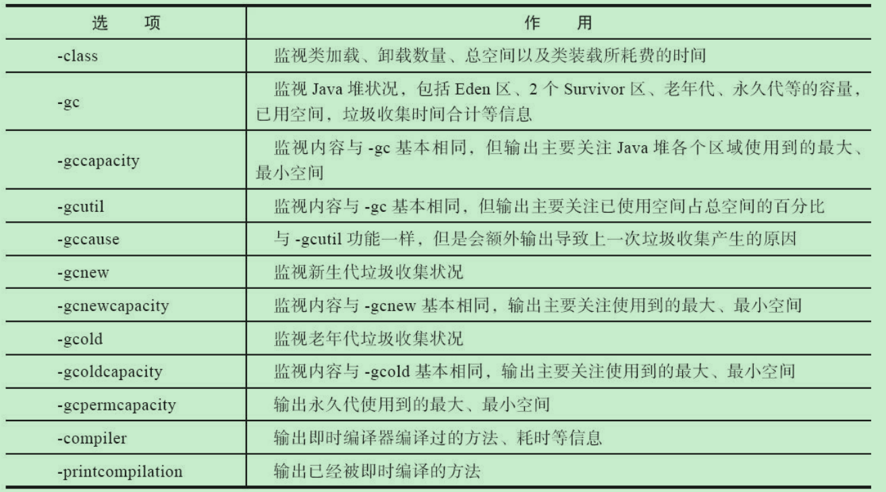

# JVM

### 虚拟机内存


> 整个JVM内存空间分为堆,栈,方法区(永久代)
>
> - <font color="red">**堆:是Java虚拟机管理的内存中最大的一块,堆是被所有线程共享的区域,虚拟机创建时启动,存放的是对象的实例**</font>,堆可分为**年轻代**和**老年代**,年轻代可分为**Eden**区和两个**survivor**区,新生代和老年代的比例是1:2,默认的,Eden:from:to=8:1:1 
>
>   - 年轻代
>     - Eden
>     - From Survivor
>     - To Survivor
>   - 老年代,采用的回收算法是标记处理算法
>
> - <font color="red">**方法区(永久代):存储虚拟机加载的类信息,常量,静态变量,所有线程共享的区域,是一片连续的堆空间,**</font>配置永久代大小 **-XX:MaxPermSize** 默认是64M,64位JVM是85M,方法区相关配置如下
>
>   - -XX:PermSize=64MB            最小尺寸，初始分配
>   - -XX:MaxPermSize=256MB  最大允许分配尺寸，按需分配
>   - XX:+CMSClassUnloadingEnabled -XX:+CMSPermGenSweepingEnabled 设置垃圾不回收
>   - 默认大小
>   - -server选项下默认MaxPermSize为64m
>   - -client选项下默认MaxPermSize为32m
>
> - <font color="red">**虚拟机栈:线程私有,生命周期和线程相同,创建线程时会创建一个Java虚拟机栈**</font>
>
>   虚拟机执行Java程序的时候,每个方法都会创建一个栈帧,栈帧存放在虚拟机栈中,通过压栈出栈的方式进行调用
>
>   - 栈帧又分为:局部变量表,操作数栈,动态链接,方法出口等 **Java8中基本类型的变量存储在栈中的局部变量表中,引用型的变量只存储引用地址**
>
>   - 本地方法栈和虚拟机栈作用类似,区别是虚拟机栈为虚拟机执行Java方法服务,本地方法栈为虚拟机使用的navicat方法服务
>
> - <font color="red">**本地方法栈: 和虚拟机栈基本类似,本地方法栈指的native方法**</font>
>
> - <font color="red">**程序计数器(PC Register),记录当前线程执行程序的位置,改变计数器的值确定下一条执行的指令,线程私有**</font>
>   
> - <font color="red">**直接内存: java14新加入的NIO,可以直接调用native方法分配堆外内存**</font>
>   
> - <font color="red">**运行时常量池:是方法区的一部分**</font>
>   
>   

- **堆栈区别**

>堆是所有线程共享的区域,存放实例化的对象/数组.
>栈是线程私有的,每创建一个线程会新建一个线程栈,存储局部变量和对象的引用变量.
>方法区是所有线程共享的一块空间,主要存放加载的类信息/常量/静态变量
>
>**栈:** 在函数中定义的一些基本类型的变量和对象的引用变量都在栈内存中分配.当一块代码中定义一个变量时,Java就在栈中为这个变量分配内存空间,超出变量的作用域后,Java会自动释放为该变量分配的内存空间,该内存空间可以立即被其他所用.
>
>**堆:** 用来存放new出来的对象和数组.在堆中分配的内存,由Java虚拟机的自动垃圾回收器来处理.

- jvm内存参数配置
  - -Xms设置堆的最小空间大小. 默认是物理内存的1/64
  - -Xmx设置堆的最大空间大小. 默认是物理内存的1/4
  - -Xmn:设置年轻代大小
  - -XX:NewSize设置新生代最小空间大小。
  - -XX:MaxNewSize设置新生代最大空间大小。
  - -XX:PermSize设置永久代最小空间大小。
  - -XX:MaxPermSize设置永久代最大空间大小。
  - -Xss设置每个线程的堆栈大小
  - -XX:+UseParallelGC:选择垃圾收集器为并行收集器。此配置仅对年轻代有效。即上述配置下,年轻代使用并发收集,而年老代仍旧使用串行收集。
  - -XX:ParallelGCThreads=20:配置并行收集器的线程数,即:同时多少个线程一起进行垃圾回收。此值最好配置与处理器数目相等。


- **典型JVM参数配置参考:** 

>- java-Xmx3550m-Xms3550m-Xmn2g-Xss128k
>- -XX:ParallelGCThreads=20
>- -XX:+UseConcMarkSweepGC-XX:+UseParNewGC

- -Xmx3550m:设置JVM最大可用内存为3550M。
- -Xms3550m:设置JVM促使内存为3550m。此值可以设置与-Xmx相同,以避免每次垃圾回收完成后JVM重新分配内存。
- -Xmn2g:设置年轻代大小为2G。整个堆大小=年轻代大小+年老代大小+持久代大小。持久代一般固定大小为64m,所以增大年轻代后,将会减小年老代大小。此值对系统性能影响较大,官方推荐配置为整个堆的3/8。
- -Xss128k:设置每个线程的堆栈大小。JDK5.0以后每个线程堆栈大小为1M,以前每个线程堆栈大小为256K。更具应用的线程所需内存大小进行调整。在相同物理内存下,减小这个值能生成更多的线程。但是操作系统对一个进程内的线程数还是有限制的,不能无限生成,经验值在3000~5000左右.

- **查看堆的默认值**

```shell
java -XX:+PrintFlagsFinal -version | grep HeapSize
# 开启内存日志
-verbose:gc -XX:+PrintGCDetails -XX:+PrintGCDateStamps -XX:+PrintGCTimeStamps
```

### 对象内存布局

> 对象在内存中分为三个部分
>
> - 对象头(Mark word): 存储对象类型的指针,锁标识位,哈希码,GC年龄,线程持有的锁,偏向线程ID
> - 实例数据: 
> - 对其填充: 对象的大小必须是8字节的整倍数

##### 对象的访问定位

- 句柄方式

  > 堆中存放一个句柄池,栈中reference变量指向句柄池中的句柄,句柄存放指向对象实例数据和对象类型信息的内存地址.

- 直接访问(hotspot主要使用这种方式访问)

  > 直接访问,reference变量直接指向堆中对象实例地址


### 数据存储

那么，程序在运行时是如何存储的呢？尤其是内存是怎么分配的。有5个不同的地方可以存储数据：

1. **寄存器**（Registers）最快的存储区域，位于 CPU 内部 [^2](https://lingcoder.gitee.io/onjava8/#/大多数微处理器芯片都有额外的高速缓冲存储器，但这是按照传统存储器而不是寄存器。)。然而，寄存器的数量十分有限，所以寄存器根据需求进行分配。我们对其没有直接的控制权，也无法在自己的程序里找到寄存器存在的踪迹（另一方面，C/C++ 允许开发者向编译器建议寄存器的分配）。
2. **栈内存**（Stack）存在于常规内存 RAM（随机访问存储器，Random Access Memory）区域中，可通过栈指针获得处理器的直接支持。栈指针下移分配内存，上移释放内存。这是一种仅次于寄存器的非常快速有效的分配存储方式。创建程序时，Java 系统必须知道栈内保存的所有项的生命周期。这种约束限制了程序的灵活性。因此，虽然在栈内存上存在一些 Java 数据（如对象引用），但 Java 对象本身的数据却是保存在堆内存的。
3. **堆内存**（Heap）这是一种通用的内存池（也在 RAM 区域），所有 Java 对象都存在于其中。与栈内存不同，编译器不需要知道对象必须在堆内存上停留多长时间。因此，用堆内存保存数据更具灵活性。创建一个对象时，只需用 `new` 命令实例化对象即可，当执行代码时，会自动在堆中进行内存分配。这种灵活性是有代价的：分配和清理堆内存要比栈内存需要更多的时间（如果可以用 Java 在栈内存上创建对象，就像在 C++ 中那样的话）。随着时间的推移，Java 的堆内存分配机制现在已经非常快，因此这不是一个值得关心的问题了。
4. **常量存储**（Constant storage）常量值通常直接放在程序代码中，因为它们永远不会改变。如需严格保护，可考虑将它们置于只读存储器 ROM （只读存储器，Read Only Memory）中 [^3](https://lingcoder.gitee.io/onjava8/#/一个例子是字符串常量池。所有文字字符串和字符串值常量表达式都会自动放入特殊的静态存储中)
5. **非 RAM 存储**（Non-RAM storage）数据完全存在于程序之外，在程序未运行以及脱离程序控制后依然存在。两个主要的例子：（1）序列化对象：对象被转换为字节流，通常被发送到另一台机器；（2）持久化对象：对象被放置在磁盘上，即使程序终止，数据依然存在。这些存储的方式都是将对象转存于另一个介质中，并在需要时恢复成常规的、基于 RAM 的对象。Java 为轻量级持久化提供了支持。而诸如 JDBC 和 Hibernate 这些类库为使用数据库存储和检索对象信息提供了更复杂的支持。

##### 数据类型范围
| 基本类型 |  大小   |  最小值   |     最大值     | 包装类型  |
| :------: | :-----: | :-------: | :------------: | :-------: |
| boolean  |    —    |     —     |       —        |  Boolean  |
|   char   | 16 bits | Unicode 0 | Unicode 216 -1 | Character |
|   byte   | 8 bits  |   -128    |      +127      |   Byte    |
|  short   | 16 bits | -2<sup>15</sup> |    +2<sup>15</sup> -1    |   Short   |
|   int    | 32 bits |   -2<sup>31</sup>   |    +<sup>231</sup>-1    |  Integer  |
|   long   | 64 bits |   - 2<sup>63</sup>   |    + 2<sup>63</sup> -1    |   Long    |
|  float   | 32 bits |  IEEE754  |    IEEE754     |   Float   |
|  double  | 64 bits |  IEEE754  |    IEEE754     |  Double   |
|   void   |    —    |     —     |       —        |   Void    |


### Class类型信息

##### Class文件结构

1. 魔数和class文件版本  占四个字节

2. 次版本号   minor_version  占两个字节

3. 主版本号   major_version  占两个字节

4. 常量池

   //todo 

5. 访问标记(access_flags)  占两个字节

   ```
   ACC_PUBLIC
   ACC_FINAL
   ACC_SUPER  # 是否允许使用invokespecial字节码指令的新语义,jdk1.0.2之后编译出的类都有这个标识
   ACC_INTERFACE
   ACC_ABSTRACT
   ACC_SYNTHETIC
   ACC_ANNOTATION
   ACC_ENUM
   ACC_MODULE
   ```

6. 类索引/父类索引/接口索引集合

7. 字段表集合: 用于描述类或接口声明的变量

8. 方法表集合

   ```
   ACC_SYNCHRONIZED
   ```

   

Java虚拟机会调用"类加载器"子系统把类加载到内存中

##### 类加载步骤

1. **加载**,由类加载器执行.该步骤将查找字节码,并从这些字节码创建一个class对象.

   > 加载分几个步骤
   >
   > 1. 根据类的全限定名找到对应的class文件
   > 2. 读取class文件,把静态存储结构转化为方法区转为运行时数据结构
   > 3. 在方法区创建一个class对象,作为数据访问的入口

2. **链接**,在链接阶段将验证类中的字节码,为static字段分配存储空间,如果需要的话,解析这个类创建的对其他类的所有引用

   > 链接分三个阶段
   >
   > - 验证: 验证class类是否符合jvm虚拟机规范,以及是否对jvm有危害
   > - 准备: 为静态变量分配内存.赋初始值
   > - 解析: 将常量池内的符号引用转为直接引用

3. **初始化**,如果该类具有超类,则先初始化超类,执行static初始化器和static初始化块.

   > 执行类构造器clinit方法, javac编译器自动生成的,所有类变量赋值和静态语句块的合集

直到第一次引用一个static方法(构造器是隐士的static)或者非常量(包含static final)的static字段,才会进行初始化.

### GC

##### GC类型

- Minor GC/Young GC  新生代的垃圾回收
- Major GC/Old GC  目标只是老年代的垃圾回收(目前只有CMS收集器有这种行为)
- Mixed GC 整个新生代的收集和部分老年代的收集(目前只有G1收集器会有这种行为)
- Full GC   全局的垃圾回收

##### 判断对象是否存活
- 引用计数回收算法.

- 可达性分析算法: 通过一个根节点 Gc roots 作为起始节点集,然后根据引用关系向下搜索,搜索过程所走的路径称为引用链,如果某个对象到gc roots没有任何引用链相连,就说明此对象不可用

##### 垃圾收集算法

- **标记-清除:** 从一个跟节点进行扫描,标记出所有存活对象,最后扫描整个内存空间并清除没有被标记的对象(也可以反过来,标记需要清除的对象,扫描并清楚被标记对象)
  - 缺点:会出现大量的空间碎片,回收后的空间是不连续的.给大对象分配时内存时会提前触发full gc
  - 缺点2:执行效率不稳定,如果出现大量需要被回收对象,标记清除过程会跟着对象的增长而效率降低
- **标记-复制算法:** 将可用内存分为两块,每次只使用一块,当这一块内存使用完,把所有存活对象复制到另一块内存中,再清理掉刚才那块内存.
  - 使用场景:存活对象较少的情况下比较高效,适用于新生代
  - 缺点:可用内存是原来的一半. 对象存活率较高时,效率就会减低,会产生大量的对象复制.
- **标记-整理:** 从根节点进行扫描,标记出所有存活对象,然后扫描整个空间并清除没有被标记的对象,最后所有对象左移
  - 适用于老年代
  - 缺点是需要移动对象,扫描了整个空间两次(第一次标记存活对象,第二次清除未标记对象)
  - 优点是不会产生空间碎片
- **增量算法**:让垃圾收集线程和应用程序线程交替执行.每次垃圾收集线程只收集一小部分的内存空间,然后切换到应用程序线程.依次反复,直到垃圾收集完成.

##### 垃圾收集器

> 并发和并行区别: 
>
> 1. 并行是指多个垃圾收集线程同时执行,用户线程暂停工作
> 2. 并发是指垃圾收集线程和用户线程同时执行,或者交替执行.

- Serial 收集器[新生代]
串行(单线程)

- ParNew 收集器[新生代]
Serial 收集器的多线程版本 

- Parallel Scavenge 收集器[新生代]
特性和ParNew类似,侧重点是吞吐量 

- Serial Old收集器[老年代]  

  单线程收集器

- Parallel Old收集器[老年代]:
Parallel Scavenge的老年代版本,支持多线程并发收集,使用标记整理算法.

- CMS 收集器[老年代]: 
  以获取最短回收停顿时间为目标的收集器,基于"标记-清除"算法实现.工作流程如下

  1. 初始标记: 标记与GC Root直接关联的对象,速度很快,需要"Stop the world"
  2. 并发标记: 扫描与GC root直接关联对象的对象图.耗时最长
  3. 重新标记: 修正并发标记期间产生变动的对象,需要"Stop the world"
  4. 并发清除

- Garbage First (G1) 收集器

  在实现高吞吐量的同时,尽可能地满足垃圾收集暂停时间的要求.G1把连续的java堆内存划分为大小相同的独立区域(Region),每一个Region都可以根据需要扮演独立的Edan/Servivor/老年代空间.回收策略是优先处理回收价值最大的Region.工作流程如下:

  1. 初始标记: 标记GC Root直接关联的对象
  2. 并发标记: 从GC Root开始对堆中对象进行可达性分析,递归扫描整个对象图,标记要回收的对象.可与用户线程并发执行.
  3. 最终标记: 对用户线程做一个短暂的暂停.用于处理并发阶段结束后仍遗留下来的少量SATB记录.
  4. 筛选回收:负责更新Region的统计数据,对各个Region的回收成本和价值进行排序,根据用户的期望时间制定回收计划,可以自由选择任意多个Region进行回收.然后决定把哪块Region复制到空的Region中,清理掉旧的Region空间.整个操作必须暂停用户线程,由多条收集器并行完成.
  
- ZGC收集器

  JDK11推出的低延迟垃圾收集器,适用于大内存低延迟的内存管理和回收.

- Shenandoah

  与G1收集器类似,基于Region设计的垃圾回收器.停顿时间和堆大小没有关系.停顿时间与ZGC接近.


> gc流程
>
> 1. 新创建的对象实例都存放在edan中,会先判断edan剩余内存够不够用,足够的话直接分配内存
> 2. 不够的话,执行minor gc,执行完继续判断够不够,足够分配
> 3. 不够的话,去survivor区看内存够不够,会继续判断老年代剩余内存是否足够
> 4. 老年代不够会执行full gc

空间分配担保:

> 在发生Minor GC之前
>
> 1. 虚拟机必须先检查老年代最大可用的连续空间是否大于新生代所有对象总空间,如果这个条件成立,那这一次M inor GC可以确保是安全的.
> 2. 如果不成立,则虚拟机会先查看-XX:HandlePromotionFailure参数的设置值是否允许担保失败(Handle Promotion Failure);
> 3. 如果允许,那会继续检查老年代最大可用的连续空间是否大于历次晋升到老年代对象的平均大小,如果大于,将尝试进行一次Minor GC,尽管这次Minor GC是有风险的;
> 4. 如果小于,或者-XX：HandlePromotionFailure设置不允许冒险,那这时就要改为进行一次Full GC.

### 查看虚拟机信息常用命令


##### 正在运行在jvm上的进程
```bash
jps -l
```
##### 虚拟机统计信息监控
```bash
jstat [option vmid [interval[s|ms]] [count]]
```
option参数表示用户希望查看的信息   `jstat -gcutil 12000 1000 3` 隔一秒输出一次GC情况

- interval   间隔多少时间
- count     输出次数



##### java配置信息
```bash
jinfo [option] pid
```
##### Java内存映像工具(堆栈信息转褚工具) 
```bash
jmap [option] vmid # jmap,查看堆信息
```
option参数如下


- **<font color="red">进程信息dump下来命令[ jmap -dump:format=b,file=dumpFileName pid ]</font>**

##### 虚拟机堆转储快照分析工具 jhat 配合dump下来的快照使用

##### Java堆栈追踪工具 ,查看堆栈信息    `jstack`
```bash
jstack [option] vmid  # 查看对战信息
jstack vmid > fileName  # 转储堆栈信息
```

##### jdk自带的可视化工具
```bash
jconsole
jvisualvm
```
