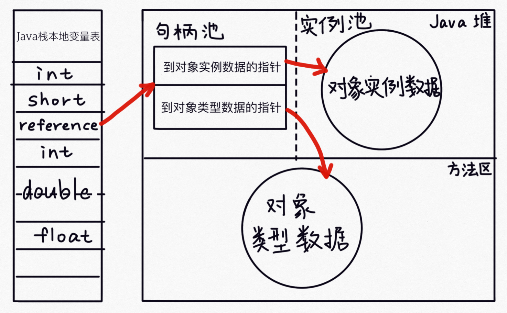

### 虚拟机运行时数据区域

 整个 JVM 内存空间分为堆,栈,方法区(永久代)

 - **堆:是 Java 虚拟机管理的内存中最大的一块,堆是被所有线程共享的区域,虚拟机创建时启动,存放的是对象的实例**,堆可分为**年轻代**和**老年代**,年轻代可分为**Eden**区和两个**survivor**区,新生代和老年代的比例是 1:2,默认的,Eden:from:to=8:1:1

   - 年轻代
     - Eden
     - From Survivor
     - To Survivor
   - 老年代,采用的回收算法是标记处理算法

 - **方法区(1.7以及之前的实现是永久代,1.8以及之后的实现是元空间):存储虚拟机加载的类信息,常量,静态变量,所有线程共享的区域,是一片连续的堆空间,占用空间是本地内存. 方法区是 jvm 的一种规范,元空间是 hotspot 对方法区的实现.类似接口和类的关系.**配置永久代大小 **-XX:MaxPermSize** 默认是 64M,64 位 JVM 是 85M,方法区相关配置如下

   - -XX:PermSize=64MB 最小尺寸，初始分配
   - -XX:MaxPermSize=256MB 最大允许分配尺寸，按需分配
   - XX:+CMSClassUnloadingEnabled -XX:+CMSPermGenSweepingEnabled 设置垃圾不回收
   - 默认大小
   - -server 选项下默认 MaxPermSize 为 64m
   - -client 选项下默认 MaxPermSize 为 32m

 - **虚拟机栈:线程私有,生命周期和线程相同,创建线程时会创建一个 Java 虚拟机栈**

   虚拟机执行 Java 程序的时候,被调用的每个方法都会创建一个栈帧,栈帧存放在虚拟机栈中,通过压栈出栈的方式进行调用

   - 栈帧又分为:局部变量表,操作数栈,动态链接,方法出口等 **Java8 中基本类型的变量存储在栈中的局部变量表中,引用型的变量只存储引用地址**

 - **本地方法栈: 和虚拟机栈基本类似,本地方法栈指的 native 方法**

   - 本地方法栈和虚拟机栈作用类似,区别是虚拟机栈为虚拟机执行 Java 方法服务,本地方法栈为虚拟机使用的 navicat 方法服务

 - **程序计数器(PC Register),记录当前线程执行程序的位置,改变计数器的值确定下一条执行的指令,线程私有**

 - **直接内存: java14 新加入的 NIO,可以直接调用 native 方法分配堆外内存**

 - **运行时常量池:是方法区的一部分**

#### **堆栈区别**

 堆是所有线程共享的区域,存放实例化的对象/数组.
 栈是线程私有的,每创建一个线程会新建一个线程栈,存储局部变量和对象的引用变量.
 方法区是所有线程共享的一块空间,主要存放加载的类信息/常量/静态变量

 **栈:** 在函数中定义的一些基本类型的变量和对象的引用变量都在栈内存中分配.当一块代码中定义一个变量时,Java 就在栈中为这个变量分配内存空间,超出变量的作用域后,Java 会自动释放为该变量分配的内存空间,该内存空间可以立即被其他所用.

 **堆:** 用来存放 new 出来的对象和数组.在堆中分配的内存,由 Java 虚拟机的自动垃圾回收器来处理.

#### 直接内存和堆内存比较

- 直接内存申请耗费性能更高
- 直接内存读取优于堆内存
- 直接内存作用链: 本地IO->直接内存->本地IO
- 堆内存作用链: 本地IO -> 直接内存 -> 非直接内存 -> 直接内存 -> 本地IO

### 数据存储

那么，程序在运行时是如何存储的呢？尤其是内存是怎么分配的。有 5 个不同的地方可以存储数据：

1. **寄存器**（Registers）最快的存储区域，位于 CPU 内部 [^2](https://lingcoder.gitee.io/onjava8/#/大多数微处理器芯片都有额外的高速缓冲存储器，但这是按照传统存储器而不是寄存器。)。然而，寄存器的数量十分有限，所以寄存器根据需求进行分配。我们对其没有直接的控制权，也无法在自己的程序里找到寄存器存在的踪迹（另一方面，C/C++ 允许开发者向编译器建议寄存器的分配）。
2. **栈内存**（Stack）存在于常规内存 RAM（随机访问存储器，Random Access Memory）区域中，可通过栈指针获得处理器的直接支持。栈指针下移分配内存，上移释放内存。这是一种仅次于寄存器的非常快速有效的分配存储方式。创建程序时，Java 系统必须知道栈内保存的所有项的生命周期。这种约束限制了程序的灵活性。因此，虽然在栈内存上存在一些 Java 数据（如对象引用），但 Java 对象本身的数据却是保存在堆内存的。
3. **堆内存**（Heap）这是一种通用的内存池（也在 RAM 区域），所有 Java 对象都存在于其中。与栈内存不同，编译器不需要知道对象必须在堆内存上停留多长时间。因此，用堆内存保存数据更具灵活性。创建一个对象时，只需用 `new` 命令实例化对象即可，当执行代码时，会自动在堆中进行内存分配。这种灵活性是有代价的：分配和清理堆内存要比栈内存需要更多的时间（如果可以用 Java 在栈内存上创建对象，就像在 C++ 中那样的话）。随着时间的推移，Java 的堆内存分配机制现在已经非常快，因此这不是一个值得关心的问题了。
4. **常量存储**（Constant storage）常量值通常直接放在程序代码中，因为它们永远不会改变。如需严格保护，可考虑将它们置于只读存储器 ROM （只读存储器，Read Only Memory）中 [^3](https://lingcoder.gitee.io/onjava8/#/一个例子是字符串常量池。所有文字字符串和字符串值常量表达式都会自动放入特殊的静态存储中)
5. **非 RAM 存储**（Non-RAM storage）数据完全存在于程序之外，在程序未运行以及脱离程序控制后依然存在。两个主要的例子：（1）序列化对象：对象被转换为字节流，通常被发送到另一台机器；（2）持久化对象：对象被放置在磁盘上，即使程序终止，数据依然存在。这些存储的方式都是将对象转存于另一个介质中，并在需要时恢复成常规的、基于 RAM 的对象。Java 为轻量级持久化提供了支持。而诸如 JDBC 和 Hibernate 这些类库为使用数据库存储和检索对象信息提供了更复杂的支持。

#### 数据类型范围

| 基本类型 |  大小   |      最小值      |       最大值        | 包装类型  |
| :------: | :-----: | :--------------: | :-----------------: | :-------: |
| boolean  |    —    |        —         |          —          |  Boolean  |
|   char   | 16 bits |    Unicode 0     |   Unicode 216 -1    | Character |
|   byte   | 8 bits  |       -128       |        +127         |   Byte    |
|  short   | 16 bits | -215  | +215 -1  |   Short   |
|   int    | 32 bits | -231  |  +231-1  |  Integer  |
|   long   | 64 bits | - 263 | + 263 -1 |   Long    |
|  float   | 32 bits |     IEEE754      |       IEEE754       |   Float   |
|  double  | 64 bits |     IEEE754      |       IEEE754       |  Double   |
|   void   |    —    |        —         |          —          |   Void    |

### 对象创建过程

1. 类加载检查

   虚拟机在解析.class文件时,若遇到new指令,首先会去检查常量池中是否已经有这个类的符号引用,并且检查这个符号引用所代表的类是否已经被**加载-解析-初始化**过,如果没有,先进行类加载的过程.

2. 为新生对象分配内存

   对象所需内存大小在类加载过程中已经可以确定,然后从内存中划分一块内存给新对象.划分对象主要有两种方法,具体使用哪种方法主要根据内存是否规整来定的.

   - 指针碰撞:适用于内存规整情况,使用一个指针指向已使用内存地址和未使用内存地址的分界点,分配时向右移动对应内存大小位置.

   - 空闲列表: 用于内存不规整情况,虚拟机会维护一个未使用的内存列表,分配的时候找到一个容量合适的内存块.

   > 内存分配时的线程安全问题,线程A在分配指针,还没来得及修改,线程B又用了原来的指针分配内存, 虚拟机通过两种方式保证线程安全
   >
   > CAS+失败重试机制.
   >
   > TLAB: 每个线程分配一个本地线程缓冲区(thread local allocation buffer),每个线程先在本地缓冲区分配,分配完之后在使用CAS+重试机制.

3. 初始化

   - 初始化零值: 虚拟机将分配的内存空间设置零值,保证可以在未设置值的情况下可以使用.
   - 设置对象头: 设置对象头中的类指针信息,gc年龄,hash值等等.
   - 执行对象的构造函数: 按照程序编码进行初始化.

#### 对象内存布局

> 对象在内存中分为三个部分
>
> - 对象头(Mark word): 存储对象类型的指针,锁标识位,哈希码,GC 年龄,线程持有的锁,偏向线程 ID
> - 实例数据:
> - 对其填充: 对象的大小必须是 8 字节的整倍数

#### 对象的访问定位

- 句柄方式

  > 堆中存放一个句柄池,栈中 reference 变量指向句柄池中的句柄,句柄存放指向对象实例数据和对象类型信息的内存地址.
  >
  > 优势: 对象移动的时候(GC 时常见),只需要改变句柄池中的指针,不需要改变 reference

  

- 直接访问(hotspot 主要使用这种方式访问)

  > 直接访问,reference 变量直接指向堆中对象实例地址. 指针存放在对象头中.
  >
  > 优势: 减少一次指针定位到对象实例数据的开销

  