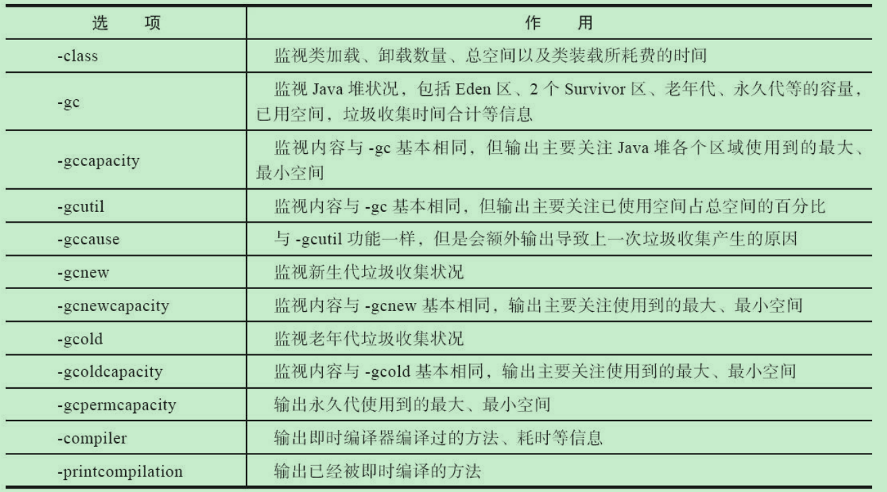
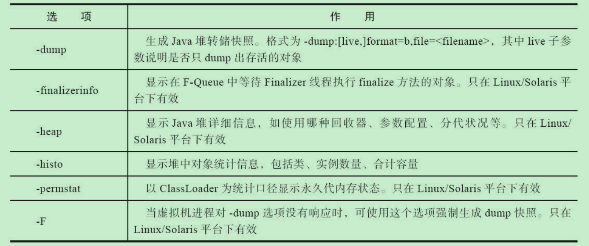

## JVM问题排查

### Java线上故障一般几个方面

- CPU
  ```shell
  # 使用ps命令查找占用内存比较高的进程的pid
  ps -aux|grep java
  # 使用top命令查找占用内存较高的线程
  top -H -p <pid>
  ```
- 内存
内存问题主要是堆/GC/堆外内存问题.
- 磁盘
- 网络

### JDK性能监视工具常用命令

```shell
# jps 虚拟机进程状况工具
jps -l

# jstat 虚拟机统计信息监视工具
jstat [option vmid]
jstat -gc [PID] 1000 #查看 GC 次数，时间等信息，每隔一秒打印一次。

# jmap Java内存映像工具
jmap [option] vmid
jmap -histo [PID] | head -20 #查看堆内存占用空间最大的前 20 个对象类型,可初步查看是哪个对象占用了内存。
jmap -dump:live,format=b,file=/home/myheapdump.hprof PID #dump 堆内存信息到文件。

# jstack Java堆栈跟踪工具
jstack [option] vmid

# jinfo java配置信息工具
jinfo [option] pid

# jhat 虚拟机堆转储快照分析工具

# 可视化多合一故障处理工具
jvisualvm
```

jstat option参数


jmap option参数


### 第三方性能监视工具

- MAT:Java堆内存分析工具
- arthas: 阿里开源诊断工具
- async-profiler: java应用性能分析工具，开源，火焰图，跨平台


## JVM常见参数配置

|        收集器         |  参数及默认值         |      备注           |
| :------------: | :------------: | :----------------------: |
|   Serial  | -XX:+UseSerialGC        | 虚拟机在Client模式下的默认值,开启后,使用 Serial + Serial Old 的组合 |
|  ParNew  |   -XX:+UseParNewGC  | 开启后,使用ParNew + Serial Old的组合   |
|  | -XX:ParallelGCThreads=n  | 设置垃圾收集器在并行阶段使用的垃圾收集线程数,当逻辑处理器数量小于8时,n的值与逻辑处理器数量相同;如果逻辑处理器数量大于8个,则n的值大约为逻辑处理器数量的5/8,大多数情况下是这样,除了较大的SPARC系统,其中n的值约为逻辑处理器的5/16. |
|   Parallel Scavenge   |  -XX:+UseParallelGC   | 虚拟机在Server模式下的默认值,开启后,使用 Parallel Scavenge + Serial Old的组合 |
|  | -XX:MaxGCPauseMillis=n | 收集器尽可能保证单次内存回收停顿的时间不超过这个值,但是并不保证不超过该值 |
|   | -XX:GCTimeRatio=n   | 设置吞吐量的大小,取值范围0-100,假设 GCTimeRatio 的值为 n,那么系统将花费不超过 1/(1+n) 的时间用于垃圾收集 |
|  |-XX:+UseAdaptiveSizePolicy  | 开启后,无需人工指定新生代的大小（-Xmn）、 Eden和Survisor的比例（-XX:SurvivorRatio）以及晋升老年代对象的年龄（-XX:PretenureSizeThreshold）等参数,收集器会根据当前系统的运行情况自动调整 |
|    Serial Old| 无 | Serial Old是Serial的老年代版本,主要用于 Client 模式下的老生代收集,同时也是 CMS 在发生 Concurrent Mode Failure时的后备方案 |
| Parallel Old  | -XX:+UseParallelOldGC            | 开启后,使用Parallel Scavenge + Parallel Old的组合.Parallel Old是Parallel Scavenge的老年代版本,在注重吞吐量和 CPU 资源敏感的场合,可以优先考虑这个组合 |
| CMS | -XX:+UseConcMarkSweepGC | 开启后,使用ParNew + CMS的组合；Serial Old收集器将作为CMS收集器出现 Concurrent Mode Failure 失败后的后备收集器使用 |
|                       |   -XX:CMSInitiatingOccupancyFraction=68    |   CMS 收集器在老年代空间被使用多少后触发垃圾收集,默认68%    |
|                       |     -XX:+UseCMSCompactAtFullCollection     |     在完成垃圾收集后是否要进行一次内存碎片整理,默认开启     |
|                       |      -XX:CMSFullGCsBeforeCompaction=0      |      在进行若干次Full GC后就进行一次内存碎片整理,默认0      |
|                       |     -XX:+UseCMSInitiatingOccupancyOnly     | 允许使用占用值作为启动CMS收集器的唯一标准,一般和CMSFullGCsBeforeCompaction配合使用.如果开启,那么当CMSFullGCsBeforeCompaction达到阈值就开始GC,如果关闭,那么JVM仅在第一次使用CMSFullGCsBeforeCompaction的值,后续则自动调整,默认关闭. |
|                       |       -XX:+CMSParallelRemarkEnabled        | 重新标记阶段并行执行,使用此参数可降低标记停顿,默认打开（仅适用于ParNewGC） |
|                       |        -XX:+CMSScavengeBeforeRemark        | 开启或关闭在CMS重新标记阶段之前的清除（YGC）尝试.新生代里一部分对象会作为GC Roots,让CMS在重新标记之前,做一次YGC,而YGC能够回收掉新生代里大多数对象,这样就可以减少GC Roots的开销.因此,打开此开关,可在一定程度上降低CMS重新标记阶段的扫描时间,当然,开启此开关后,YGC也会消耗一些时间.PS. 开启此开关并不保证在标记阶段前一定会进行清除操作,生产环境建议开启,默认关闭. |
|    CMS-Precleaning    |         -XX:+CMSPrecleaningEnabled         |                 是否启用并发预清理,默认开启                 |
| CMS-AbortablePreclean | -XX:CMSScheduleRemark EdenSizeThreshold=2M | 如果伊甸园的内存使用超过该值,才可能进入“并发可中止的预清理”这个阶段 |
| CMS-AbortablePreclean |     -XX:CMSMaxAbortablePrecleanLoops=0     |   “并发可终止的预清理阶段”的循环次数,默认0,表示不做限制    |
| CMS-AbortablePreclean |   -XX:+CMSMaxAbortablePrecleanTime=5000    |            “并发可终止的预清理”阶段持续的最大时间            |
|                       |       -XX:+CMSClassUnloadingEnabled        |             使用CMS时,是否启用类卸载,默认开启              |
|                       |      -XX:+ExplicitGCInvokesConcurrent      | 显示调用System.gc()会触发Full GC,会有Stop The World,开启此参数后,可让System.gc()触发的垃圾回收变成一次普通的CMS GC. |
| G1|-XX:+UseG1GC | 使用G1收集器 |
||-XX:G1HeapRegionSize=n           | 设置每个region的大小,该值为2的幂,范围为1MB到32MB,如不指定G1会根据堆的大小自动决定 |
|                       |          -XX:MaxGCPauseMillis=200          |             设置最大停顿时间,默认值为200毫秒.              |
|                       |           -XX:G1NewSizePercent=5           | 设置年轻代占整个堆的最小百分比,默认值是5,这是个实验参数.需用-XX:+UnlockExperimentalVMOptions解锁试验参数后,才能使用该参数. |
|                       |         -XX:G1MaxNewSizePercent=60         | 设置年轻代占整个堆的最大百分比,默认值是60,这是个实验参数.需用-XX:+UnlockExperimentalVMOptions解锁试验参数后,才能使用该参数. |
|                       |          -XX:ParallelGCThreads=n           | 设置垃圾收集器在并行阶段使用的垃圾收集线程数,当逻辑处理器数量小于8时,n的值与逻辑处理器数量相同；如果逻辑处理器数量大于8个,则n的值大约为逻辑处理器数量的5/8,大多数情况下是这样,除了较大的SPARC系统,其中n的值约为逻辑处理器的5/16. |
|                       |            -XX:ConcGCThreads=n             | 设置垃圾收集器并发阶段使用的线程数量,设置n大约为ParallelGCThreads的1/4. |
|                       |   -XX:InitiatingHeapOccupancyPercent=45    |      老年代大小达到该阈值,就触发Mixed GC,默认值为45.      |
|                       |    -XX:G1MixedGCLiveThresholdPercent=85    | Region中的对象,活跃度低于该阈值,才可能被包含在Mixed GC收集周期中,默认值为85,这是个实验参数.需用-XX:+UnlockExperimentalVMOptions解锁试验参数后,才能使用该参数. |
|                       |          -XX:G1HeapWastePercent=5          | 设置浪费的堆内存百分比,当可回收百分比小于浪费百分比时,JVM就不会启动Mixed GC,从而避免昂贵的GC开销.此参数相当于用来设置允许垃圾对象占用内存的最大百分比. |
|                       |         -XX:G1MixedGCCountTarget=8         | 在一次回收过程中指定做几次筛选回收(默认8次)，在最后一个筛选回收阶段可以回收一会，然后暂停回收，恢复系统运行，一会再开始回收，这样可以让系统不至于单次停顿时间过长。  |
|                       |   -XX:G1OldCSetRegionThresholdPercent=10   | 设置在一次Mixed GC中被收集的老年代的比例上限,默认值是Java堆的10%,这是个实验参数.需用-XX:+UnlockExperimentalVMOptions解锁试验参数后,才能使用该参数. |
|                       |          -XX:G1ReservePercent=10           | 设置预留空闲内存百分比,虚拟机会保证Java堆有这么多空间可用,从而防止对象晋升时无空间可用而失败,默认值为Java堆的10％. |
|                       |          -XX:-G1PrintHeapRegions           |           输出Region被分配和回收的信息,默认false            |
|                       |       -XX:-G1PrintRegionLivenessInfo       | 在清理阶段的并发标记环节,输出堆中的所有Regions的活跃度信息,默认false |
|      Shenandoah       |            -XX:+UseShenandoahGC            | 使用UseShenandoahGC,这是个实验参数,需用-XX:+UnlockExperimentalVMOptions解锁试验参数后,才能使用该参数；另外该参数只能在Open JDK中使用,Oracle JDK无法使用 |
|          ZGC          |                -XX:+UseZGC                 | 使用ZGC,这是个实验参数,需用-XX:+UnlockExperimentalVMOptions解锁试验参数后,才能使用该参数; |
|        Epsilon        |             -XX:+UseEpsilonGC              | 使用EpsilonGC,这是个实验参数,需用-XX:+UnlockExperimentalVMOptions解锁试验参数后,才能使用该参数 |

补充

> [GC[PSYoungGen 表示用的是年轻代使用Parallel Scavenge收集器。
>  [GC[ParNew 表示使用的是年轻代使用ParNew收集器(Parallel New收集器)。
>  [GC[DefNew 表示用的是年轻代使用Serial收集器(Serial New收集器)。
>  [GC[PSOldGen 表示用的是老年代使用的Parallel Old收集器。

堆配置：

* -Xms:初始堆大小
* -Xms：最大堆大小
* -XX:NewSize=n:设置年轻代大小
* -XX:NewRatio=n:设置年轻代和年老代的比值。如：为 3 表示年轻代和年老代比值为 1：3，年轻代占整个年轻代年老代和的 1/4
* -XX:SurvivorRatio=n:年轻代中 Eden 区与两个 Survivor 区的比值。注意 Survivor 区有两个。如 3 表示 Eden： 3 Survivor：2，一个 Survivor 区占整个年轻代的 1/5
* -XX:MaxPermSize=n:设置持久代大小


收集器设置：

* -XX:+UseSerialGC:设置串行收集器
* -XX:+UseParallelGC:设置并行收集器
* -XX:+UseParalledlOldGC:设置并行年老代收集器
* -XX:+UseConcMarkSweepGC:设置并发收集器
* -XX:+UseG1GC

并行收集器设置

* -XX:ParallelGCThreads=n:设置并行收集器收集时使用的CPU 数.并行收集线程数
* -XX:MaxGCPauseMillis=n:设置并行收集最大的暂停时间(如果到这个时间了,垃圾回收器依然没有回收完,也会停止回收)
* -XX:GCTimeRatio=n:设置垃圾回收时间占程序运行时间的百分比.公式为：1/(1+n)
* -XX:+CMSIncrementalMode:设置为增量模式.适用于单CPU情况.


打印GC回收日志

```shell
java -XX:+PrintFlagsFinal -version | grep HeapSize
# 开启内存日志
-verbose:gc -XX:+PrintGCDetails -XX:+PrintGCDateStamps -XX:+PrintGCTimeStamps -Xloggc:filename
```

- 打印详情
  - -XX:-PrintGCDetails
  - -XX:+PrintGCDateStamps
  - -XX:+PrintGCTimeStamps
- jdk8 默认参数
  - -Xmx(1/4 PhyMem) -Xms (1/64 PhyMem[物理内存])
  - Parallel GC 多线程 GC
  - -XX:NewRatio=2 (年轻代和老年代大小比例,2为年轻代:老年代 1:2) -XX: SurvivorRatio=8(设置年轻代中survivor和edan区比例 8为1:8)
  - -XX:+UseAdaptiveSizePolicy

其他

  ```java
  -Xms              #设置堆的初始大小. 默认是物理内存的1/64
  -Xmx              #设置堆的最大空间大小. 默认是物理内存的1/4
  -Xmn              #设置年轻代大小
  -Xss              #设置每个线程的堆栈大小
  -XX:NewSize       #设置新生代最小空间大小
  -XX:MaxNewSize    #设置新生代最大空间大小
  -XX:PermSize      #设置永久代最小空间大小(jdk1.8已被弃用)
  -XX:MaxPermSize   #设置永久代最大空间大小(jdk1.8已被弃用)
  -XX:MetaspaceSize #设置元空间初始大小
  -XX:MaxMetaspaceSize #设置元空间最大大小
  
  -XX:+UseParallelGC  #选择垃圾收集器为并行收集器。此配置仅对年轻代有效。即上述配置下,年轻代使用并发收集,而年老代仍旧使用串行收集。
  -XX:ParallelGCThreads=8  #配置并行收集器的线程数,即:同时多少个线程一起进行垃圾回收。此值最好配置与处理器数目相等。
  -XX:+UseConcMarkSweepGC  #老年代开启CMS GC
  -XX:+UseParNewGC   # 新生代使用并行收集器
  -XX:+HeapDumpOnOutOfMemoryError  # 当oom时把堆内存dump下来
  
  
  ‐XX:+UseG1GC  # 开启G1收集器
  ‐XX:G1HeapRegionSize -> 指定分区大小(1MB~32MB，且必须是2的幂)，默认将整堆划分为2048个分区
  ‐XX:MaxGCPauseMillis -> 目标暂停时间(默认200ms)
  ‐XX:G1NewSizePercent -> 新生代内存初始空间(默认整堆5%)
  ‐XX:G1MaxNewSizePercent -> 新生代内存最大空间
  ‐XX:TargetSurvivorRatio -> Survivor区的填充容量(默认50%)，Survivor区域里的一批对象(年龄1+年龄2+年龄n的多个年龄对象)总和超过了Survivor区域的50%，此时就会把年龄n(含)以上的对象都放入老年代
  ‐XX:InitiatingHeapOccupancyPercent -> 老年代占用空间达到整堆内存阈值(默认45%)，则执行 新生代和老年代的混合收集(MixedGC)，比如我们之前说的堆默认有2048个region，如果有接近 1000个region都是老年代的region，则可能就要触发MixedGC了
  ‐XX:G1HeapWastePercent -> 默认5%， gc过程中空出来的region是否充足阈值，在混合回收的时候，对Region回收都是基于复制算法进行的，都是把要回收的Region里的存活对象放入其他 Region，然后这个Region中的垃圾对象全部清理掉，这样的话在回收过程就会不断空出来新的 Region，一旦空闲出来的Region数量达到了堆内存的5%，此时就会立即停止混合回收，意味着 本次混合回收就结束了。
  ‐XX:G1MixedGCLiveThresholdPercent -> 默认85%，region中的存活对象低于这个值时才会回收该region，如果超过这个值，存活对象过多，回收的的意义不大。
  ‐XX:G1MixedGCCountTarget -> 在一次回收过程中指定做几次筛选回收(默认8次)，在最后一个筛选回收阶段可以回收一会，然后暂停回收，恢复系统运行，一会再开始回收，这样可以让系统不至于单次停顿时间过长。
  ```


### 常用组合配置

|      Young      |       Old       |                JVM Option                |
| :-------------: | :-------------: | :--------------------------------------: |
|     Serial      |     Serial      |            -XX:+UserSerialGC             |
|    Parallel     | Parallel/Serial | -XX:+UseParallelGC -XX:+UseParallelOldGC |
| Serial/Parallel |       CMS       |   -XX:+UseParNewGC -XX:+UseConcSweepGC   |
|       G1        |        -        |               -XX:+UseG1GC               |


### 服务端常用组合

```shell
ENV JAVA_OPTS="\
-server \
-Xmx256m \
-Xms256m \
-Xmn128m \
-XX:SurvivorRatio=8 \
-XX:MetaspaceSize=64m \
-XX:MaxMetaspaceSize=128m \
-XX:+UseParallelGC \
-XX:ParallelGCThreads=4 \
-XX:+UseParallelOldGC \
-XX:+UseAdaptiveSizePolicy \
-XX:+PrintGCDetails \
-XX:+PrintTenuringDistribution \
-XX:+PrintGCDateStamps \
-XX:+PrintGCTimeStamps \
-XX:+HeapDumpOnOutOfMemoryError \
-XX:HeapDumpPath=/ \
-Xloggc:/gc.log \
-XX:+UseGCLogFileRotation \
-XX:NumberOfGCLogFiles=5 \
-XX:GCLogFileSize=10M"
```


## CPU占用过高排查思路

1. 先找出哪个进程占用CPU高
  top 列出系统各个进程的资源占用情况。

2. 然后根据找到对应进行里哪个线程占用CPU高
  top -Hp 进程 ID 列出对应进程里面的线程占用资源情况

3. 找到对应线程 ID 后，再打印出对应线程的堆栈信息
printf "%x\n" PID 把线程 ID 转换为 16 进制。
jstack PID 打印出进程的所有线程信息，从打印出来的线程信息中找到上一步转换为 16 进制的线程 ID 对应的线程信息。

4. 最后根据线程的堆栈信息定位到具体业务方法,从代码逻辑中找到问题所在。

查看是否有线程长时间的 watting 或 blocked，如果线程长期处于 watting 状态下， 关注 watting on xxxxxx，说明线程在等待这把锁，然后根据锁的地址找到持有锁的线程。

## 内存彪高排查思路

分析：内存飚高如果是发生在 java 进程上,一般是因为创建了大量对象所导致,持续飚高说明垃圾回收跟不上对象创建的速度,或者内存泄露导致对象无法回收.

1. 先观察垃圾回收的情况
  `jstat -gc PID 1000` 查看 GC 次数，时间等信息，每隔一秒打印一次。
  `jmap -histo PID | head -20` 查看堆内存占用空间最大的前 20 个对象类型,可初步查看是哪个对象占用了内存。
  如果每次 GC 次数频繁，而且每次回收的内存空间也正常，那说明是因为对象创建速度快导致内存一直占用很高；如果每次回收的内存非常少，那么很可能是因为内存泄露导致内存一直无法被回收。

2. 导出堆内存文件快照
  `jmap -dump:live,format=b,file=/home/myheapdump.hprof PID` dump堆内存信息到文件。

3. 使用 visualVM 对 dump 文件进行离线分析，找到占用内存高的对象，再找到创建该对象的业务代码位置，从代码和业务场景中定位具体问题。

## 频繁Full GC排查思路

1. 导致频繁fgc的原因

  - 大对象：系统一次性加载了过多数据到内存中（比如 SQL 查询未做分页），导致大对象进入了老年代。
  - 内存泄漏：频繁创建了大量对象，但是无法被回收（比如 IO 对象使用完后未调用 close 方法释放资源），先引发 FGC，最后导致 OOM.
  - 程序频繁生成一些长生命周期的对象，当这些对象的存活年龄超过分代年龄时便会进入老年代，最后引发 FGC. 
  - 代码中显式调用了 gc方法，包括自己的代码甚至框架中的代码。
  - JVM 参数设置问题：包括总内存大小、新生代和老年代的大小、Eden 区和 S 区的大小、元空间大小、垃圾回收算法等等。

2. 排查问题时可能使用的工具

  - 常用jdk自带工具，`jmap/jstate`等
  - 可视化分析工具，JVisualVM、MAT

## 内存泄漏排查思路

内存泄漏的表现可能有：
- 应用程序长时间连续运行时性能严重下降
- CPU 使用率飙升，甚至到 100%
- 频繁 Full GC，各种报警，例如接口超时报警等
- 应用程序抛出 OutOfMemoryError 错误
- 应用程序偶尔会耗尽连接对象

严重内存泄漏往往伴随频繁的 Full GC，所以分析排查内存泄漏问题首先还得从查看 Full GC 入手。主要有以下操作步骤：

1. 使用jps 查看运行的 Java 进程 ID
2. 使用top -p [pid] 查看进程使用 CPU 和 MEM 的情况
3. 使用 top -Hp [pid] 查看进程下的所有线程占 CPU 和 MEM 的情况
4. 将线程 ID 转换为 16 进制：`printf "%x\n" [pid]`，输出的值就是线程栈信息中的 nid。
  例如：`printf "%x\n" 29471`，换行输出 731f。

5. 抓取线程栈：jstack 29452 > 29452.txt，可以多抓几次做个对比。
  在线程栈信息中找到对应线程号的 16 进制值，如下是 731f 线程的信息。线程栈分析可使用 Visualvm 插件 TDA。

  ```java
  "Service Thread" #7 daemon prio=9 os_prio=0 tid=0x00007fbe2c164000 nid=0x731f runnable [0x0000000000000000]
  java.lang.Thread.State: RUNNABLE
  ```

6. 使用jstat -gcutil [pid] 5000 10 每隔 5 秒输出 GC 信息，输出 10 次，查看 YGC 和 Full GC 次数.通常会出现 YGC 不增加或增加缓慢,而Full GC增加很快.
  或使用 `jstat -gccause [pid] 5000`,同样是输出 GC 摘要信息.
  或使用 `jmap -heap [pid]` 查看堆的摘要信息,关注老年代内存使用是否达到阀值，若达到阀值就会执行 Full GC.

7. 如果发现 Full GC 次数太多，就很大概率存在内存泄漏了

8. 使用 `jmap -histo:live [pid]` 输出每个类的对象数量，内存大小(字节单位)及全限定类名。

9. 生成 dump 文件，借助工具分析哪 个对象非常多，基本就能定位到问题在那了
  使用 jmap 生成 dump 文件：
  ```java
  # jmap -dump:live,format=b,file=29471.dump 29471
  Dumping heap to /root/dump ...
  Heap dump file created
  ```

10. dump 文件分析
  可以使用 jhat 命令分析：`jhat -port 8000 29471.dump`，浏览器访问 jhat 服务，端口是 8000。
  通常使用图形化工具分析，如 JDK 自带的 jvisualvm，从菜单 > 文件 > 装入 dump 文件。
  或使用第三方式具分析的，如 JProfiler 也是个图形化工具，GCViewer 工具。Eclipse 或以使用 MAT 工具查看。或使用在线分析平台 GCEasy。
  **注意：如果 dump 文件较大的话，分析会占比较大的内存。**

11. 在 dump 文析结果中查找存在大量的对象，再查对其的引用。基本上就可以定位到代码层的逻辑了。
