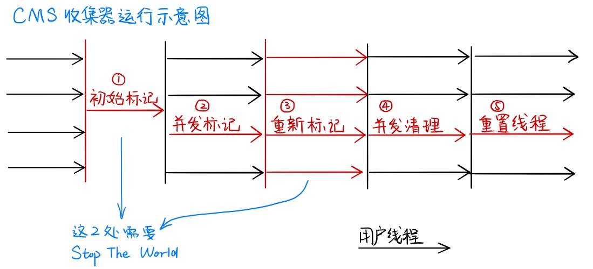

### Class 类型信息

Class 文件只有两种数据类型,**无符号数和表**

> 无符号数: 基本的数据类型, u1/u2/u4/u8 分别代表 1 个字节/4 个字节/8 个字节的无符号数. 用来描述数字/索引引用/数量值/字符串
>
> 表: 表是由多个无符号数或者其他表作为数据项组成的复杂数据类型.

#### Class 文件结构

1. 魔数(0xcafebabe) 占四个字节

2. 次版本号(major_version 占两个字节)和主版本号(minor_version 占两个字节)

3. 常量池

   **常量池主要存放两大类常量: 字面量和符号引用. 字面量一般是字符串或者常量值等. 符号引用属于编译原理方面的概念.主要包括以下几类常量:**

   - 被模块导出或开发的包
   - 类和接口的全限定名
   - 字段的名称和描述符
   - 方法的名称和描述符
   - 方法句柄和方法类型
   - 动态调用点和动态常量

4. 访问标记(access_flags):用于识别类或者接口层次的访问信息 占两个字节

   ```
   ACC_PUBLIC
   ACC_FINAL
   ACC_SUPER  # 是否允许使用invokespecial字节码指令的新语义,jdk1.0.2之后编译出的类都有这个标识
   ACC_INTERFACE
   ACC_ABSTRACT
   ACC_SYNTHETIC
   ACC_ANNOTATION
   ACC_ENUM
   ACC_MODULE
   ```

5. 类索引/父类索引/接口索引集合

6. 字段表集合: 用于描述类或接口声明的变量

   字段表结构主要包含以下几个
   |类型 | 名称 | 数量|
   | :-:|:-:|:-: |
   | u2 | access_flags | 1 |
   | u2 | name_index | 1 |
   | u2 | descriptor_index | 1 |
   | u2 | attributes_count | 1 |
   | attribute_info | attributes | attributes_count |

7. 方法表集合: 结构和字段表集合一样.

   ```
   ACC_SYNCHRONIZED
   ```

8. 属性表集合(attribute_info):

Java 虚拟机会调用"类加载器"子系统把类加载到内存中

#### 字节码指令

1. 加载和存储指令: 用于将数据在栈帧中的局部变量表和操作数栈之间来回传输
   - 将一个局部变量加载到操作数栈 : <t>load\_<n>
   - 将一个数值从操作数栈存储到局部变量表 <t>store\_<n>
   - 将一个常量加载到操作数栈
2. 运算指令 : 用于将操作数栈上的两个值进行指定运算,并把结果重新存入操作数栈顶.

   - 加(add)/减(sub)/乘(mul)/除(div)/取余(rem)/求反(neg)/位移(shl)

3. 类型转换指令: 将两种不同的数值类型进行转换,用于代码中的显式转换类型操作

4. 对象创建和访问指令
   - 创建类示例 new / 创建数组示例 (newarray/anewarray/multianewarray)
   - 访问类字段 getfield/putfield/getstatic/putstatic
   - 把一个数组元素加载到操作数栈的指令: baload/caload/salod/iaload/faload/daload/aaload
   - 将一个操作数栈的值存储到数组元素的指令: bastore/castore/sastore/iastore/fastore/dastore/aastore
   - 获取数组长度指令: arraylength
   - 检查类示例类型的指令: instanceof/checkcast
5. 操作数栈管理指令
   - 将操作数栈栈顶元素移除: pop/pop2
   - 将栈顶两个元素交换位置: swap
   - 复制栈顶一个或两个数值并将复制的值重新压入栈顶: dup/dup2/dup_x1/dup2_x1
6. 控制转移指令: 可以让 jvm 虚拟机有条件或无条件的从指定位置指令的下一条指令继续执行程序.
   - 条件分支 ifeq/iflt/ifle/ifne/ifgt/ifge/ifnull/ifnonnull/if_icmpeq/...
   - 复合条件分支: tableswitch/lookupswitch
   - 无条件分支: goto/goto_w/jsr/jsr_w/ret
7. 方法调回和返回指令

   1. invokevirtual 指令: 调用实例方法
   2. invokeinterface 指令: 调用接口方法
   3. invokespecial: 调用私有方法/父类方法
   4. invokestatic: 调用类静态方法
   5. invokedynamic: 用于在运行时动态解析出调用点限定符所引用的方法.

8. 异常处理指令:

   1. 同步指令: **java 虚拟机可以支持方法级的同步和方法内部一段指令序列的同步. 这两种同步结构都是使用管程(Monitor,俗称锁)实现的.**

### 类加载

#### 类加载时机

类加载主要分为`加载`>`验证`>`准备`>`解析`>`初始化`>`使用`>`卸载` 几个步骤. 前四个步骤属于**加载->连接**过程,jvm 虚拟机规范没有强制规定,交给虚拟机的具体实现自由把握.而初始化步骤严格规定只有以下六种情况会立即对类进行初始化操作

- 遇到`new`/`getstatic`/`putstatic`/`invokestatic`四个指令时,如果没有对类进行初始化操作会先初始化
- 使用反射操作对操作类时.
- 初始化类时,父类没有进行初始化,先初始化父类.
- 虚拟机启动,先初始化 main 方法所在类
- 使用 jdk7 加入的动态语言支持时, 在 java.lang.invoke.MethodHandle 对象生成的指令为 getstatic/putstatic/invokestatic/newInvokestatic 四种类型的方法句柄,方法所在类没有初始化,先进行初始化操作
- jdk8 新加入的接口 default 方法,有接口的实现类进行初始化操作,会先初始化父类

以上是主动引用,会触发类的初始化操作,被动引用不会触发类的初始化操作. 被动引用有以下几种

- 通过子类使用父类的静态字段
- 定义类的数组
- 使用类静态常量的情况不会触发

#### 类加载过程

1. **加载**,由类加载器执行.该步骤将查找字节码,并从这些字节码创建一个 class 对象.

   > 加载分几个步骤
   >
   > 1. 根据类的全限定名找到对应的 class 文件
   > 2. 读取 class 文件,把静态存储结构转化为方法区转为运行时数据结构
   > 3. 在方法区创建一个 class 对象,作为数据访问的入口

   **加载阶段和连接阶段的部分动作是交叉进行的,加载阶段尚未完成,连接部分阶段已经开始. 开始顺序仍然保持固定的先后顺序.**

2. **连接**,在连接阶段将验证类中的字节码,为 static 字段分配存储空间,如果需要的话,解析这个类创建的对其他类的所有引用

   > 连接分三个阶段
   >
   > - 验证: 验证 class 类是否符合 jvm 虚拟机规范,以及是否对 jvm 有危害
   > - 准备: 为静态变量分配内存.赋初始值
   > - **解析: 将常量池内的符号引用转为直接引用\*\***
   >   - 符号引用指通过一组符号(字面量)引用定义目标.和内存布局无关.
   >   - 直接引用是直接指向目标的指针/相对偏移量/或者能直接定位的句柄.

3. **初始化,执行类构造器(\<clinit\>)的过程**,如果该类具有超类,则先初始化超类,执行 static 初始化器和 static 初始化块.

   **遇到 new/getstatic/putstatic/invokestatic 指令时才会执行初始化方法**

   > 执行类构造器 clinit 方法, javac 编译器自动生成的所有类变量赋值和静态语句块的合集. 合集的顺序是根据源文件出现的顺序决定的. 静态语句块内只能访问在此之前的静态变量.

直到第一次引用一个 static 方法(构造器是隐式的 static)或者非常量(包含 static final)的 static 字段,才会进行初始化.

#### 类加载器

虚拟机角度主要分为两种类加载器. Bootstrap Class Loader 和其他类加载器. BootstrapClassLoader 类加载器负责加载<JAVA_HOME>/lib 目录下的类. 由 C++语言实现(仅限 HotSpot 虚拟机).是虚拟机自身的一部分. 其他类加载器都是 java 语言实现,都是继承自 java.lang.ClassLoader 抽象类.

从开发者的角度看分以下几种

- 启动加载器(Bootstrap Class Loader) : 负责加载<java_home>/lib 目录下的类库. 开发者无法获取启动加载器的引用.

- 扩展类加载器,主要实现是 sun.misc.Launcher$ExtClassLoader 类,主要加载<java_home>/lib/ext 包或者 java.ext.dirs 环境变量的类库.

- 引用程序类加载器(Application Class Loader),主要实现在 sun.misc.Launcher$AppClassLoader 类.负责加载用户(UserClassPath)路径下的类库. 由于 ClassLoader.getSystemClassLoader()方法返回的是此加载器,所以也被称为**系统加载器**.
- 用户自定义类加载器: 自己实现的类加载器

双亲委派模型要求除了引导类加载器之外都要有自己的父类加载器.

**双亲委派模型工作流程: 某个类加载器受到加载类的请求时,先交给父类加载器去加载. 如果父类加载器反馈无法加载,再自己进行加载. 父子关系通过组合实现,不是继承. ** 好处是 java 类和他的类加载器具备了一种优先级的层次关系. 可以避免重复加载和核心 api 被篡改.

因为只有在全限定名和类加载器完全相等的情况下,才会被认定为一个类. 避免核心 api 被篡改. 避免类的重复加载.

### 虚拟机字节码执行引擎

字节码在执行时最小的执行单元是栈帧. 一个方法在虚拟机中代表一个栈帧. 栈帧中主要包含元素有以下四种:

- **操作数栈**

  是一个先入后出的栈. 最大长度在编译阶段已经确定.

- **局部变量表**

  存放方法参数和运行时定义的局部变量. 实例方法第一个参数是当前对象.最大长度在编译阶段已经确定.

- **动态连接**

  字节码中没有保存对象在内存中的地址, 在方法中有对常量池中符号引用的引用,符号引用转为直接引用称为动态连接. 在类加载或者第一次使用时,有一个静态链接.

  每个 class 文件的常量池中有大量的符号引用. 字节码的方法调用指令就以常量池里指向方法的符号引用作为参数. 这些符号引用一部分会在类加载阶段或者第一次使用的时候被转为直接引用.这种称为静态连接. 另一部分在每一次运行期间转化为直接引用,这种称为动态连接.

- 方法返回地址

  只有两种方式退出方法. 1: 遇到方法返回的字节码指令. 2: 执行中遇到了异常.

#### 方法调用

方法调用字节码 **invoke**

- invokestatic: 调用静态方法. 静态分派
- invokespecial: 调用私有实例方法和构造器和父类实例方法. 静态分派
- invokevirtual: 调用非私有实例方法. 属于动态分派
- invokeinterface: 调用接口方法. 动态分派
- invokedynmaic: 调用动态方法

> 方法调用并不等于方法被执行.方法调用的唯一任务是找到被调用方法的版本(即调用哪个方法).
>
> Class 文件中并没有保存运行时的方法内存布局中的入口地址. 存储的都是符号引用. 这个特性给 java 带来了更强大的动态扩展能力.

1. **解析调用**: 在编译的时候已经确认调用的方法. 在类加载的时候把符号引用转为直接引用.
2. **分派调用**
   1. 静态分派. 编译时或者加载时确认的方法
   2. 动态分派
   3. 多分派

### JVM 内存

#### 相关知识点

所有对象都在堆上分配.

##### Stop The World(STW)

工作线程停止,应用卡顿.

##### Safe Point 安全点

一个安全的时刻,GC 线程可以开始扫描 GC Roots.

#### 四种对象引用类型

- 强引用: `Object o=new Object();` 这种属于强引用,这种对象永远不会被回收.
- 软引用: 在发生 oom 之前还会再进行一次 gc,这次 gc 会把软引用对象回收掉,如果内存依然不够,会发生 oom. 实现类`SoftReference`
- 弱引用: 对象可以存活到下次 gc 之前,一旦发生 gc,就会被回收. 实现类 `WeakReference`
- 虚引用: 幽灵引用. 对对象没有任何影响. 在回收的时候,jvm 会收到此对象被回收的通知. 实现类 `PhantomReference`

#### 判断对象是否存活

- 引用计数回收算法.

- 可达性分析算法: 通过一个根节点 Gc roots 作为起始节点集,然后根据引用关系向下搜索,搜索过程所走的路径称为引用链,如果某个对象到 gc roots 没有任何引用链相连,就说明此对象不可用

  **可以作为 GC Root 根对象有以下几种**

  - 栈:
    1. 虚拟机栈中局部变量表中引用的对象
    2. 本地方法栈 jni 引用的对象
  - 方法区
    1. 类中静态变量引用的对象
    2. 常量引用的对象
  - 堆
    - 存活的 Thread 对象

#### 执行 GC 之前的判定

当没有内存空间的时候,首先进行可达性分析(标记过程),将不可达对象放入死亡队列,垃圾回收器调用其 finalize 方法,真正死亡的进入垃圾回收过程.

执行 GC 之前要判定哪些对象需要被回收. **jvm 使用一种 oopMap 数据结构存储了栈中本地变量表和引用对象的关系.** 只需要遍历 oopMap 对象就可以判定哪些对象不可达. 而 oopMap 不是一直不变的,程序需要找到安全点去更新 oopMap 和进行 gc, **安全点一般选取在方法调用/循环结束/异常跳转/方法返回等位置.** 进行 GC 需要 Stop The World. 停止所有线程. **一般有两种方式中断线程: 抢先式中断和主动式中断. 抢先式是先中断所有线程,如果有线程不在安全点,恢复,跑到安全点在挂起. 主动式中断是虚拟机设置一个中断标识,线程主动去轮询,跑到安全点自动挂起.**

**安全区域是指线程在执行的区域不会发生引用变化,因此一直处于安全点.** 线程执行到安全区域时,会把自己设置为 Safe Region, jvm 发生 gc 时,不会理会安全区域的线程. 线程出安全区域时,会先判断系统是否在执行 gc,如果在,则等待 gc 结束再继续执行.

#### GC 类型

- Minor GC/Young GC 新生代的垃圾回收
- Major GC/Old GC 目标只是老年代的垃圾回收(目前只有 CMS 收集器有这种行为)
- Mixed GC 整个新生代的收集和部分老年代的收集(目前只有 G1 收集器会有这种行为)
- Full GC 全局的垃圾回收

#### 垃圾收集算法

- **标记-清除(Mark And Sweep):** 从一个跟节点进行扫描,标记出所有存活对象,最后扫描整个内存空间并清除没有被标记的对象(也可以反过来,标记需要清除的对象,扫描并清楚被标记对象)
  - 缺点:会出现大量的空间碎片,回收后的空间是不连续的.给大对象分配时内存时会提前触发 full gc
  - 缺点 2:执行效率不稳定,如果出现大量需要被回收对象,标记清除过程会跟着对象的增长而效率降低
- **标记-复制算法(Mark and Copy):** 将可用内存分为两块,每次只使用一块,当这一块内存使用完,把所有存活对象复制到另一块内存中,再清理掉刚才那块内存.
  - 使用场景:存活对象较少的情况下比较高效,适用于新生代
  - 缺点:可用内存是原来的一半. 对象存活率较高时,效率就会减低,会产生大量的对象复制.
- **标记-整理(Mark-Sweep-Compact):** 从根节点进行扫描,标记出所有存活对象,然后扫描整个空间并清除没有被标记的对象,最后所有对象左移
  - 适用于老年代
  - 缺点是需要移动对象,扫描了整个空间两次(第一次标记存活对象,第二次清除未标记对象)
  - 优点是不会产生空间碎片
- **增量算法**:让垃圾收集线程和应用程序线程交替执行.每次垃圾收集线程只收集一小部分的内存空间,然后切换到应用程序线程.依次反复,直到垃圾收集完成.

#### 垃圾收集器

> 并发和并行区别:
>
> 1. 并行是指多个垃圾收集线程同时执行,用户线程暂停工作
> 2. 并发是指垃圾收集线程和用户线程同时执行,或者交替执行.

- Serial 收集器[新生代] . 启用参数`-XX:+UseSerialGC`
  串行(单线程)

- Serial Old 收集器[老年代]

  单线程收集器

- ParNew 收集器[新生代]
  Serial 收集器的多线程版本

- Parallel Scavenge 收集器[新生代]
  特性和 ParNew 类似,侧重点是吞吐量

- Parallel Old 收集器[老年代]:
  Parallel Scavenge 的老年代版本,支持多线程并发收集,使用标记整理算法.

- CMS 收集器[老年代]:
  以获取最短回收停顿时间为目标的收集器,基于"标记-清除"算法实现. **特点是低延迟** 工作流程如下

  1. 初始标记: 标记与 GC Root 直接关联的对象,速度很快,需要"Stop the world"
  2. 并发标记: 扫描与 GC root 直接关联对象的对象图.耗时最长
  3. 重新标记: 修正并发标记期间产生变动的对象,需要"Stop the world"
  4. 并发清除

  

- Garbage First (G1) 收集器

  在实现高吞吐量的同时,尽可能地满足垃圾收集暂停时间的要求.G1 把连续的 java 堆内存划分为大小相同的独立区域(Region),每一个 Region 都可以根据需要扮演独立的 Edan/Servivor/老年代空间.回收策略是优先处理回收价值最大的 Region.工作流程如下:

  1. 初始标记: 标记 GC Root 直接关联的对象
  2. 并发标记: 从 GC Root 开始对堆中对象进行可达性分析,递归扫描整个对象图,标记要回收的对象.可与用户线程并发执行.
  3. 最终标记: 对用户线程做一个短暂的暂停.用于处理并发阶段结束后仍遗留下来的少量 SATB 记录.
  4. 筛选回收:负责更新 Region 的统计数据,对各个 Region 的回收成本和价值进行排序,根据用户的期望时间制定回收计划,可以自由选择任意多个 Region 进行回收.然后决定把哪块 Region 复制到空的 Region 中,清理掉旧的 Region 空间.整个操作必须暂停用户线程,由多条收集器并行完成.

  

- ZGC 收集器

  JDK11 推出的低延迟垃圾收集器,适用于大内存低延迟的内存管理和回收. 可伸缩/低延迟的垃圾收集器. GC 停顿时间不超过 10ms.应用吞吐能力不会下降 15%.

- Shenandoah

  java12 引入.RedHat 开发的. 与 G1 收集器类似,基于 Region 设计的垃圾回收器.停顿时间和堆大小没有关系.停顿时间与 ZGC 接近.

> gc 流程
>
> 1. 新创建的对象实例都存放在 edan 中,会先判断 edan 剩余内存够不够用,足够的话直接分配内存
> 2. 不够的话,执行 minor gc,执行完继续判断够不够,足够分配
> 3. 不够的话,去 survivor 区看内存够不够,会继续判断老年代剩余内存是否足够
> 4. 老年代不够会执行 full gc

空间分配担保:

> 在发生 Minor GC 之前
>
> 1. 虚拟机必须先检查老年代最大可用的连续空间是否大于新生代所有对象总空间,如果这个条件成立,那这一次 M inor GC 可以确保是安全的.
> 2. 如果不成立,则虚拟机会先查看-XX:HandlePromotionFailure 参数的设置值是否允许担保失败(Handle Promotion Failure);
> 3. 如果允许,那会继续检查老年代最大可用的连续空间是否大于历次晋升到老年代对象的平均大小,如果大于,将尝试进行一次 Minor GC,尽管这次 Minor GC 是有风险的;
> 4. 如果小于,或者-XX：HandlePromotionFailure 设置不允许冒险,那这时就要改为进行一次 Full GC.

#### GC 参数相关

开启 GC 日志

```shell
java -XX:+PrintFlagsFinal -version | grep HeapSize
# 开启内存日志
-verbose:gc -XX:+PrintGCDetails -XX:+PrintGCDateStamps -XX:+PrintGCTimeStamps
```

- 打印详情
  - -XX: -PrintGCDetails
  - -XX:+PrintGCDateStamps
  - -XX:+PrintGCTimeStamps
- jdk8 默认参数
  - -Xmx(1/4 PhyMem) -Xms (1/64 PhyMem[物理内存])
  - Parallel GC 多线程 GC
  - -XX:NewRatio=2 (年轻代和老年代大小比例) -XX: SurvivorRatio=8()
  - -XX:+UseAdaptiveSizePolicy
- jvm 常用参数

  ```shell
  -Xms              #设置堆的初始大小. 默认是物理内存的1/64
  -Xmx              #设置堆的最大空间大小. 默认是物理内存的1/4
  -Xmn              #设置年轻代大小
  -Xss              #设置每个线程的堆栈大小
  -XX:NewSize       #设置新生代最小空间大小
  -XX:MaxNewSize    #设置新生代最大空间大小
  -XX:PermSize      #设置永久代最小空间大小
  -XX:MaxPermSize   #设置永久代最大空间大小

  -XX:+UseParallelGC  #选择垃圾收集器为并行收集器。此配置仅对年轻代有效。即上述配置下,年轻代使用并发收集,而年老代仍旧使用串行收集。
  -XX:ParallelGCThreads=20  #配置并行收集器的线程数,即:同时多少个线程一起进行垃圾回收。此值最好配置与处理器数目相等。
  -XX:+UseConcMarkSweepGC  #老年代开启CMS GC
  -XX:+UseParNewGC   # 新生代使用并行收集器
  -XX:+HeapDumpOnOutOfMemoryError  # 当oom时把堆内存dump下来

  ```

##### 常用组合

|      Young      |       Old       |                JVM Option                |
| :-------------: | :-------------: | :--------------------------------------: |
|     Serial      |     Serial      |            -XX:+UserSerialGC             |
|    Parallel     | Parallel/Serial | -XX:+UseParallelGC -XX:+UseParallelOldGC |
| Serial/Parallel |       CMS       |   -XX:+UseParNewGC -XX:+UseConcSweepGC   |
|       G1        |        -        |               -XX:+UseG1GC               |

### 查看虚拟机信息常用命令

#### 正在运行在 jvm 上的进程

```bash
jps -l
```

#### 虚拟机统计信息监控

```bash
jstat [option vmid [interval[s|ms]] [count]]
```

option 参数表示用户希望查看的信息 `jstat -gcutil 12000 1000 3` 隔一秒输出一次 GC 情况

- interval 间隔多少时间
- count 输出次数


#### java 配置信息

```bash
jinfo [option] pid
```

#### Java 内存映像工具(堆栈信息转褚工具)

```bash
jmap [option] vmid # jmap,查看堆信息
```

option 参数如下


- **<font color="red">进程信息 dump 下来命令[ jmap -dump:live,format=b,file=dumpFileName pid ]</font>**

#### 虚拟机堆转储快照分析工具 jhat 配合 dump 下来的快照使用

#### Java 堆栈追踪工具 ,查看堆栈信息 `jstack`

```bash
jstack [option] vmid  # 查看堆栈信息
jstack vmid > fileName  # 转储堆栈信息
```

#### jdk 自带的可视化工具

```bash
jconsole
jvisualvm
```
