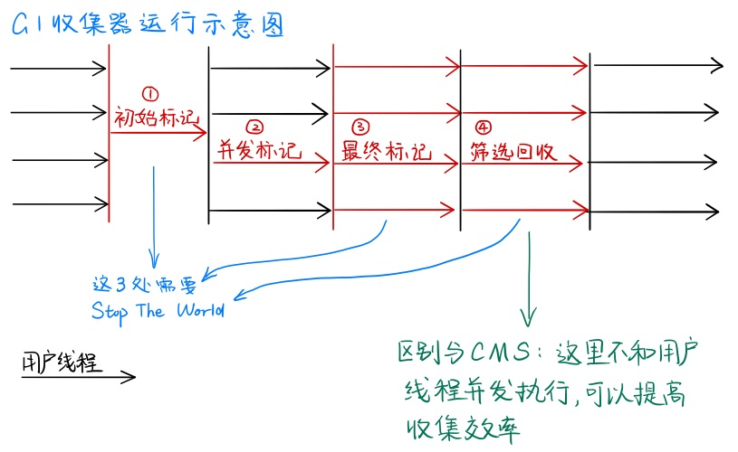

## 相关知识点

所有对象都在堆上分配.

### Stop The World(STW)

工作线程停止,应用卡顿.

### Safe Point 安全点

一个安全的时刻,GC 线程可以开始扫描 GC Roots.

## 四种对象引用类型

- 强引用: `Object o=new Object();` 这种属于强引用,这种对象永远不会被回收.
- 软引用: 在发生 oom 之前还会再进行一次 gc,这次 gc 会把软引用对象回收掉,如果内存依然不够,会发生 oom. 实现类`SoftReference`
- 弱引用: 对象可以存活到下次 gc 之前,一旦发生 gc,就会被回收. 实现类 `WeakReference`
- 虚引用: 幽灵引用. 对对象没有任何影响. 在回收的时候,jvm 会收到此对象被回收的通知. 实现类 `PhantomReference`

## 判断对象是否存活

- 引用计数回收算法.

- 可达性分析算法: 通过一个根节点 Gc roots 作为起始节点集,然后根据引用关系向下搜索,搜索过程所走的路径称为引用链,如果某个对象到 gc roots 没有任何引用链相连,就说明此对象不可用

  **可以作为 GC Root 根对象有以下几种**

  - 栈:
    1. 虚拟机栈中局部变量表中引用的对象
    2. 本地方法栈 jni 引用的对象
  - 方法区
    1. 类中静态变量引用的对象
    2. 常量引用的对象
  - 堆
    - 存活的 Thread 对象

## 执行 GC 之前的判定

当没有内存空间的时候,首先进行可达性分析(标记过程),将不可达对象放入死亡队列,垃圾回收器调用其 finalize 方法,真正死亡的进入垃圾回收过程.

执行 GC 之前要判定哪些对象需要被回收. **jvm 使用一种 oopMap 数据结构存储了栈中本地变量表和引用对象的关系.** 只需要遍历 oopMap 对象就可以判定哪些对象不可达. 而 oopMap 不是一直不变的,程序需要找到安全点去更新 oopMap 和进行 gc, **安全点一般选取在方法调用/循环结束/异常跳转/方法返回等位置.** 进行 GC 需要 Stop The World. 停止所有线程. **一般有两种方式中断线程: 抢先式中断和主动式中断. 抢先式是先中断所有线程,如果有线程不在安全点,恢复,跑到安全点在挂起. 主动式中断是虚拟机设置一个中断标识,线程主动去轮询,跑到安全点自动挂起.**

**安全区域是指线程在执行的区域不会发生引用变化,因此一直处于安全点.** 线程执行到安全区域时,会把自己设置为 Safe Region, jvm 发生 gc 时,不会理会安全区域的线程. 线程出安全区域时,会先判断系统是否在执行 gc,如果在,则等待 gc 结束再继续执行.

## GC 类型

- Minor GC/Young GC 新生代的垃圾回收
- Major GC/Old GC 目标只是老年代的垃圾回收(目前只有 CMS 收集器有这种行为)
- Mixed GC 整个新生代的收集和部分老年代的收集(目前只有 G1 收集器会有这种行为)
- Full GC 全局的垃圾回收

### 空间分配担保机制

> 执行minor gc之前,首先判断老年代的剩余连续空间是否大于新生代所有对象总和. 如果不成立,会判断是否开启空间分配担保,允许的话,继续检查老年代剩余空间是否大于历次晋升到老年代的空间大小,如果大于,进行minor gc,否则进行full gc.
>
> `-XX:HandlePromotionFailure` 开启空间分配担保. jdk1.6 update24之后参数有,但是不会使用了.
>
> jdk6 update24之后变为只要老年代连续空间大于新生代总大小或者历次晋升平均大小,就会进行minor gc,否则full gc. 

### 哪些情况可能触发Full GC

- `System.gc();` 建议jvm进行一次gc.

- 老年代空间不足

- 永久代空间不足

- CMS GC时出现promotion failed和concurrent mode failure

  空间分配担保失败的情况

- 统计得到的minor gc晋升到老年代的平均大小大于老年代的剩余空间.

## 垃圾收集算法

- **标记-清除(Mark And Sweep):** 从一个跟节点进行扫描,标记出所有存活对象,最后扫描整个内存空间并清除没有被标记的对象(也可以反过来,标记需要清除的对象,扫描并清楚被标记对象)
  - 缺点:会出现大量的空间碎片,回收后的空间是不连续的.给大对象分配时内存时会提前触发 full gc
  - 缺点 2:执行效率不稳定,如果出现大量需要被回收对象,标记清除过程会跟着对象的增长而效率降低
- **标记-复制算法(Mark and Copy):** 将可用内存分为两块,每次只使用一块,当这一块内存使用完,把所有存活对象复制到另一块内存中,再清理掉刚才那块内存.
  - 使用场景:存活对象较少的情况下比较高效,适用于新生代
  - 缺点:可用内存是原来的一半. 对象存活率较高时,效率就会减低,会产生大量的对象复制.
- **标记-整理(Mark-Sweep-Compact):** 从根节点进行扫描,标记出所有存活对象,然后扫描整个空间并清除没有被标记的对象,最后所有对象左移
  - 适用于老年代
  - 缺点是需要移动对象,扫描了整个空间两次(第一次标记存活对象,第二次清除未标记对象)
  - 优点是不会产生空间碎片
- **增量算法**:让垃圾收集线程和应用程序线程交替执行.每次垃圾收集线程只收集一小部分的内存空间,然后切换到应用程序线程.依次反复,直到垃圾收集完成.

## 垃圾收集器

> 并发和并行区别:
>
> 1. 并行是指多个垃圾收集线程同时执行,用户线程暂停工作
> 2. 并发是指垃圾收集线程和用户线程同时执行,或者交替执行.
>
> 吞吐量= 执行用户代码时间/(执行用户代码时间+GC 所用时间)

- Serial 收集器[新生代] . 启用参数`-XX:+UseSerialGC`
  串行(单线程)

- Serial Old 收集器[老年代]

  单线程收集器

- ParNew 收集器[新生代]
  Serial 收集器的多线程版本

- Parallel Scavenge 收集器[新生代]
  特性和 ParNew 类似,侧重点是吞吐量

- Parallel Old 收集器[老年代]:
  Parallel Scavenge 的老年代版本,支持多线程并发收集,使用标记整理算法.

- CMS 收集器[老年代]:
  以获取最短回收停顿时间为目标的收集器,基于"标记-清除"算法实现. **特点是低延迟** 工作流程如下

  1. 初始标记: 标记与 GC Root 直接关联的对象,速度很快,需要"Stop the world"
  2. 并发标记: 扫描与 GC root 直接关联对象的对象图.耗时最长
  3. 重新标记: 修正并发标记期间产生变动的对象,需要"Stop the world"
  4. 并发清除

  

- Garbage First (G1) 收集器

  在实现高吞吐量的同时,尽可能地满足垃圾收集暂停时间的要求.G1 把连续的 java 堆内存划分为大小相同的独立区域(Region),每一个 Region 都可以根据需要扮演独立的 Edan/Servivor/老年代空间.回收策略是优先处理回收价值最大的 Region.工作流程如下:

  1. 初始标记: 标记 GC Root 直接关联的对象
  2. 并发标记: 从 GC Root 开始对堆中对象进行可达性分析,递归扫描整个对象图,标记要回收的对象.可与用户线程并发执行.
  3. 最终标记: 对用户线程做一个短暂的暂停.用于处理并发阶段结束后仍遗留下来的少量 SATB 记录.
  4. 筛选回收:负责更新 Region 的统计数据,对各个 Region 的回收成本和价值进行排序,根据用户的期望时间制定回收计划,可以自由选择任意多个 Region 进行回收.然后决定把哪块 Region 复制到空的 Region 中,清理掉旧的 Region 空间.整个操作必须暂停用户线程,由多条收集器并行完成.

  

- ZGC 收集器

  JDK11 推出的低延迟垃圾收集器,适用于大内存低延迟的内存管理和回收. 可伸缩/低延迟的垃圾收集器. GC 停顿时间不超过 10ms.应用吞吐能力不会下降 15%.

- Shenandoah

  java12 引入.RedHat 开发的. 与 G1 收集器类似,基于 Region 设计的垃圾回收器.停顿时间和堆大小没有关系.停顿时间与 ZGC 接近.

> gc 流程
>
> 1. 新创建的对象实例都存放在 edan 中,会先判断 edan 剩余内存够不够用,足够的话直接分配内存
> 2. 不够的话,执行 minor gc,执行完继续判断够不够,足够分配
> 3. 不够的话,去 survivor 区看内存够不够,会继续判断老年代剩余内存是否足够
> 4. 老年代不够会执行 full gc

空间分配担保:

> 在发生 Minor GC 之前
>
> 1. 虚拟机必须先检查老年代最大可用的连续空间是否大于新生代所有对象总空间,如果这个条件成立,那这一次 M inor GC 可以确保是安全的.
> 2. 如果不成立,则虚拟机会先查看-XX:HandlePromotionFailure 参数的设置值是否允许担保失败(Handle Promotion Failure);
> 3. 如果允许,那会继续检查老年代最大可用的连续空间是否大于历次晋升到老年代对象的平均大小,如果大于,将尝试进行一次 Minor GC,尽管这次 Minor GC 是有风险的;
> 4. 如果小于,或者-XX：HandlePromotionFailure 设置不允许冒险,那这时就要改为进行一次 Full GC.

## GC 参数相关

开启 GC 日志

```shell
java -XX:+PrintFlagsFinal -version | grep HeapSize
# 开启内存日志
-verbose:gc -XX:+PrintGCDetails -XX:+PrintGCDateStamps -XX:+PrintGCTimeStamps
```

- 打印详情
  - -XX: -PrintGCDetails
  - -XX:+PrintGCDateStamps
  - -XX:+PrintGCTimeStamps
- jdk8 默认参数
  - -Xmx(1/4 PhyMem) -Xms (1/64 PhyMem[物理内存])
  - Parallel GC 多线程 GC
  - -XX:NewRatio=2 (年轻代和老年代大小比例) -XX: SurvivorRatio=8()
  - -XX:+UseAdaptiveSizePolicy
- jvm 常用参数

  ```shell
  -Xms              #设置堆的初始大小. 默认是物理内存的1/64
  -Xmx              #设置堆的最大空间大小. 默认是物理内存的1/4
  -Xmn              #设置年轻代大小
  -Xss              #设置每个线程的堆栈大小
  -XX:NewSize       #设置新生代最小空间大小
  -XX:MaxNewSize    #设置新生代最大空间大小
  -XX:PermSize      #设置永久代最小空间大小
  -XX:MaxPermSize   #设置永久代最大空间大小

  -XX:+UseParallelGC  #选择垃圾收集器为并行收集器。此配置仅对年轻代有效。即上述配置下,年轻代使用并发收集,而年老代仍旧使用串行收集。
  -XX:ParallelGCThreads=20  #配置并行收集器的线程数,即:同时多少个线程一起进行垃圾回收。此值最好配置与处理器数目相等。
  -XX:+UseConcMarkSweepGC  #老年代开启CMS GC
  -XX:+UseParNewGC   # 新生代使用并行收集器
  -XX:+HeapDumpOnOutOfMemoryError  # 当oom时把堆内存dump下来

  ```

### 常用组合

|      Young      |       Old       |                JVM Option                |
| :-------------: | :-------------: | :--------------------------------------: |
|     Serial      |     Serial      |            -XX:+UserSerialGC             |
|    Parallel     | Parallel/Serial | -XX:+UseParallelGC -XX:+UseParallelOldGC |
| Serial/Parallel |       CMS       |   -XX:+UseParNewGC -XX:+UseConcSweepGC   |
|       G1        |        -        |               -XX:+UseG1GC               |
