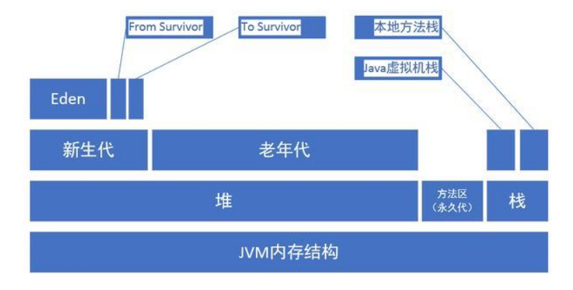

# JVM

> 整个JVM内存空间分为堆,栈,方法区(永久代)
>
> - 堆:是Java虚拟机管理的内存中最大的一块,堆是被所有线程共享的区域,虚拟机创建时启动,存放的是对象的实例,堆可分为**年轻代**和**老年代**,年轻代可分为**Eden**区和两个**survivor**区,新生代和老年代的比例是1:2,默认的,Eden:from:to=8:1:1 
>
>   - 年轻代
>     - Eden
>     - From Survivor
>     - To Survivor
>   - 老年代
>
> - 方法区(永久代):存储虚拟机加载的类信息,常量,静态变量,所有线程共享的区域,是一片连续的堆空间,配置永久代大小 **-XX:MaxPermSize** 默认是64M,64位JVM是85M,方法区相关配置如下
>
>   - -XX:PermSize=64MB            最小尺寸，初始分配
>   - -XX:MaxPermSize=256MB  最大允许分配尺寸，按需分配
>   - XX:+CMSClassUnloadingEnabled -XX:+CMSPermGenSweepingEnabled 设置垃圾不回收
>   - 默认大小
>   - -server选项下默认MaxPermSize为64m
>   - -client选项下默认MaxPermSize为32m
>
> - 栈:线程私有,生命周期和线程相同,创建线程时会创建一个Java虚拟机栈
>
>   虚拟机执行Java程序的时候,每个方法都会创建一个栈帧,栈帧存放在虚拟机栈中,通过压栈出栈的方式进行调用
>
>   - 栈帧又分为:局部变量表,操作数栈,动态链接,方法出口等 **Java8中基本类型的变量存储在栈中的局部变量表中,引用型的变量只存储引用地址**
>   - 本地方法栈和虚拟机栈作用类似,区别是虚拟机栈为虚拟机执行Java方法服务,本地方法栈为虚拟机使用的navicat方法服务
>   - 程序计数器(PC Register),记录当前线程执行程序的位置,改变计数器的值确定下一条执行的指令,线程私有
>
>   

- jvm内存参数配置
  - -Xms设置堆的最小空间大小。
  - -Xmx设置堆的最大空间大小。
  - -Xmn:设置年轻代大小
  - -XX:NewSize设置新生代最小空间大小。
  - -XX:MaxNewSize设置新生代最大空间大小。
  - -XX:PermSize设置永久代最小空间大小。
  - -XX:MaxPermSize设置永久代最大空间大小。
  - -Xss设置每个线程的堆栈大小
  - -XX:+UseParallelGC:选择垃圾收集器为并行收集器。此配置仅对年轻代有效。即上述配置下,年轻代使用并发收集,而年老代仍旧使用串行收集。
  - -XX:ParallelGCThreads=20:配置并行收集器的线程数,即:同时多少个线程一起进行垃圾回收。此值最好配置与处理器数目相等。

- **典型JVM参数配置参考:** 

>- java-Xmx3550m-Xms3550m-Xmn2g-Xss128k
>- -XX:ParallelGCThreads=20
>- -XX:+UseConcMarkSweepGC-XX:+UseParNewGC

-Xmx3550m:设置JVM最大可用内存为3550M。
-Xms3550m:设置JVM促使内存为3550m。此值可以设置与-Xmx相同,以避免每次垃圾回收完成后JVM重新分配内存。
-Xmn2g:设置年轻代大小为2G。整个堆大小=年轻代大小+年老代大小+持久代大小。持久代一般固定大小为64m,所以增大年轻代后,将会减小年老代大小。此值对系统性能影响较大,官方推荐配置为整个堆的3/8。
-Xss128k:设置每个线程的堆栈大小。JDK5.0以后每个线程堆栈大小为1M,以前每个线程堆栈大小为256K。更具应用的线程所需内存大小进行调整。在相同物理内存下,减小这个值能生成更多的线程。但是操作系统对一个进程内的线程数还是有限制的,不能无限生成,经验值在3000~5000左右.