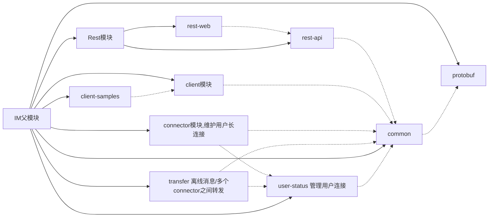

# IM笔记

**笔记内容参考 github-[IM](https://github.com/yuanrw/IM)**

## 模块脑图

```mermaid
graph LR 
A[IM父模块] --> R[Rest模块] --> RW[rest-web] .-> RA
				R --> RA[rest-api] .->Cm
A --> C[client模块] .->Cm
A --> Co[connector模块,维护用户长连接] .->US
	  Co .-> Cm
A --> P[protobuf]
A --> T[transfer 离线消息/多个connector之间转发] .->US
	  T .-> Cm
A --> Cm[common] .->P
A --> c-m[client-samples] .->C
A --> US[user-status 管理用户连接] .->Cm

```