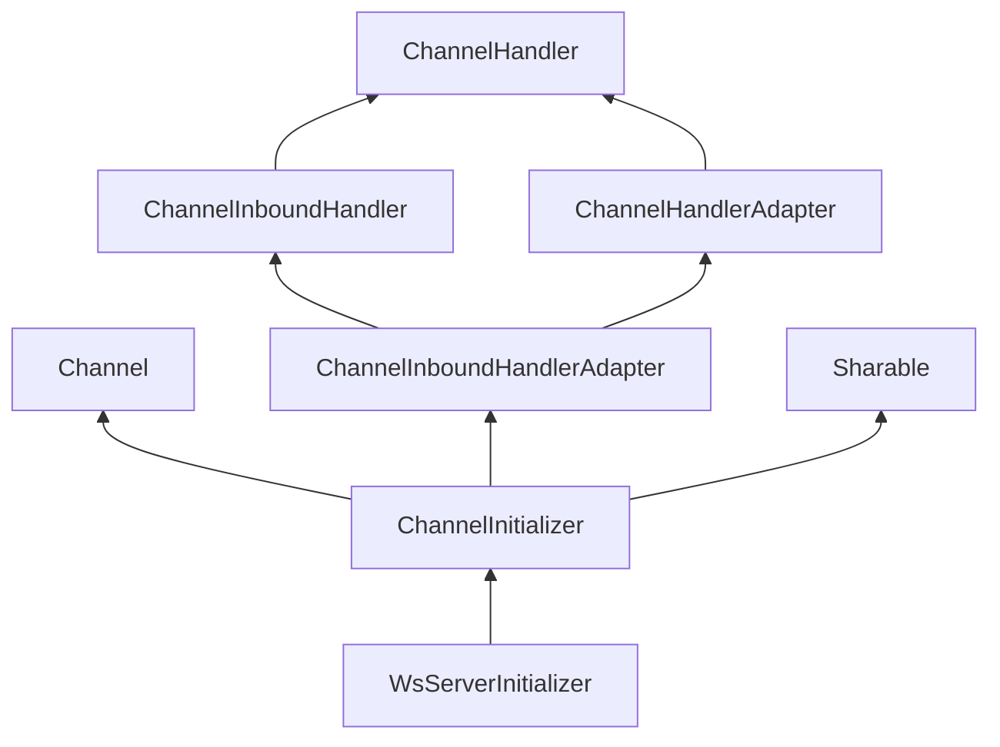

# H-IM笔记

## WebSocket Server初始化类

```mermaid
graph BT

W[WsServerInitializer] --> C[ChannelInitializer]
	C --> Channel
	C --> CIHA[ChannelInboundHandlerAdapter]
		CIHA --> CIH[ChannelInboundHandler] --> CH
		CIHA --> CHA[ChannelHandlerAdapter] --> CH
	C --> Sharable

	CH[ChannelHandler]
```

