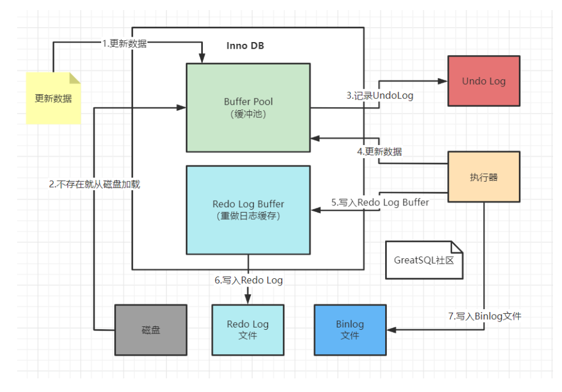
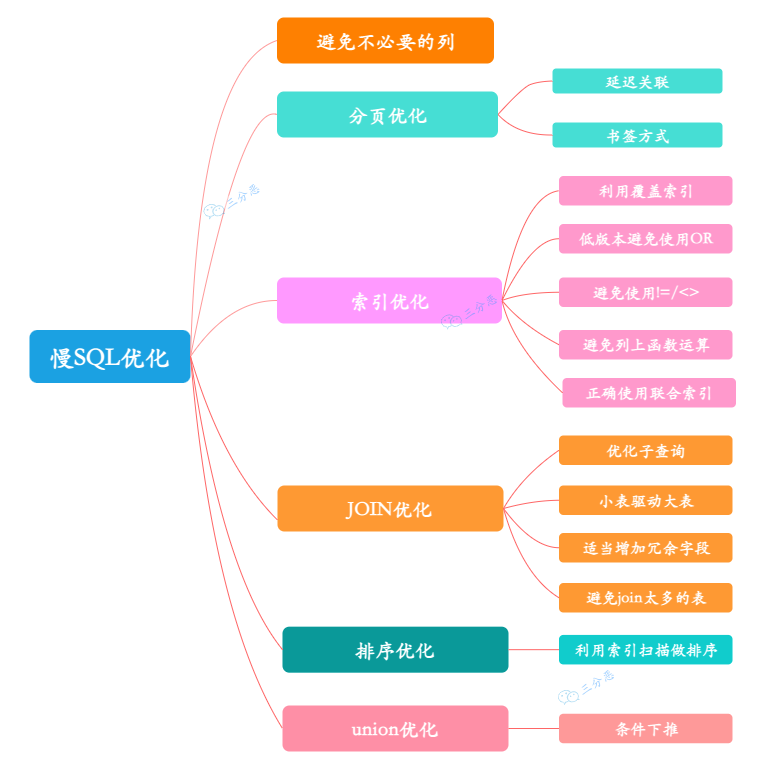

## 基础

### in和exists区别

- exists的执行原理：
  对外表做loop循环，每次loop循环再对内表（子查询）进行查询，那么因为对内表的查询使用的索引（内表效率高，故可用大表），而外表有多大都需要遍历，不可避免（尽量用小表），故内表大的使用exists，可加快效率；

- in的执行原理：
  是把外表和内表做连接，先查询内表，再把内表结果与外表匹配，对外表使用索引(外表效率高，可用大表)，而内表多大都需要查询，不可避免，故外表大的使用in，可加快效率。

**在没有创建索引的情况下，mysql服务层会把in优化为exists去执行--<高性能MySql>**
**大部分情况下，in适合外表大子表小的情况。exists适合外表小子表大的情况。主要是通过小表驱动大表去写sql。**

not in 和 not exists：如果查询语句使用了 not in，那么内外表都进行全表扫描，没有用到索引；而 not extsts 的子查询依然能用到表上的索引。所以无论那个表大，用 not exists 都比 not in 要快。

### union和union all的区别

- `union` 合并结果集之后进行去重排序
- `union all` 直接合并结果集

### count(1)/count(*)/count(列名)区别

count(1)和count(*)不会忽略null值，count(列名)会忽略null值。
count(主键)效率最高

### SQL语句的执行顺序

- FROM：对 FROM 子句中的左表<left_table>和右表<right_table>执行笛卡儿积(Cartesianproduct),产生虚拟表 VT1
- ON：对虚拟表 VT1 应用 ON 筛选，只有那些符合<join_condition>的行才被插入虚拟表 VT2 中
- JOIN：如果指定了 OUTER JOIN（如 LEFT OUTER JOIN、RIGHT OUTER JOIN），那么保留表中未匹配的行作为外部行添加到虚拟表 VT2 中，产生虚拟表 VT3。如果 FROM 子句包含两个以上表，则对上一个连接生成的结果表 VT3 和下一个表重复执行步骤 1）～步骤 3），直到处理完所有的表为止
- WHERE：对虚拟表 VT3 应用 WHERE 过滤条件，只有符合<where_condition>的记录才被插入虚拟表 VT4 中
- GROUP BY：根据 GROUP BY 子句中的列，对 VT4 中的记录进行分组操作，产生 VT5
- CUBE|ROLLUP：对表 VT5 进行 CUBE 或 ROLLUP 操作，产生表 VT6
- HAVING：对虚拟表 VT6 应用 HAVING 过滤器，只有符合<having_condition>的记录才被插入虚拟表 VT7 中。
- SELECT：第二次执行 SELECT 操作，选择指定的列，插入到虚拟表 VT8 中
- DISTINCT：去除重复数据，产生虚拟表 VT9
- ORDER BY：将虚拟表 VT9 中的记录按照<order_by_list>进行排序操作，产生虚拟表 VT10。11）
- LIMIT：取出指定行的记录，产生虚拟表 VT11，并返回给查询用户

### MqSQL架构

1. 连接层 管理客户端和服务连接，权限认证
2. 服务层: 一些sql接口，解析器，优化器，缓存
3. 存储引擎: 负责MySql中数据的存储和提取，服务层通过API与存储引擎进行通信
4. 数据存储层： 将数据存储在运行于裸设备的文件系统之上，并完成和存储引擎的交互

### sql执行流程

1. 客户端通过协议将SQL语句发送给MySQL服务器
2. 检查是否有权限，然后查询缓存，如果缓存命中，直接返回缓存数据。未命中，进入下一个环节
3. 服务层进行SQL解析，预处理，然后查询优化器生成对应的执行计划
4. 服务器根据执行计划，再调用存储引擎的API执行查询
5. 将结果返回给客户端，如果开启了缓存，备份一份到查询缓存中

## 事务

### 事务日志

1. redo log(重做日志) 
2. undo log(回滚日志)
3. binlog(二进制日志)
4. error log(错误日志)
5. slow query log(慢查询日志)
6. general log(一般查询日志)
7. relay log(中继日志)



#### redo log(重做日志): 保证事物ACID中的持久性
  InnoDB作为存储引擎,数据都是存放在磁盘中,如果每次读取数据都读取磁盘,速度会很慢. InnoDB提供了缓存(Buffer Pool) 加快读取速度.Buffer Pool中保存对磁盘中部分数据页的映射.解决CPU和磁盘之间的读写速度差异。
  有两部分组成，redo log buffer(保存在内存中，容易丢失)和redo log file（保存在硬盘中，保证持久化）。

  redo log流程

  1. 先将磁盘数据读取到内存中，修改数据的内存拷贝
  2. 生成一条重做日志(redo log)并写入到redo log buffer，记录的是被修改后的值
  3. 当事务commit的时候，将redo log buffer中的内容刷新到redo log file中，对redo log file采用追加写的方式
  4. 定期将内存中修改的数据刷新到磁盘中

  刷盘策略
  redo log buffer刷盘到redo log file中，并不是真正的刷到磁盘中，只是刷盘到**文件系统缓存 Page Cache中**，现代操作系统为了提高写磁盘效率做的优化。真正的写入会交给系统来决定。交给系统也存在系统宕机，数据丢失的情况。InnoDB给出`innodb_flush_log_at_trx_commit`参数，该参数控制刷盘的频率。
  - 该值为0：每次事务提交时不进行刷盘操作.(系统master thread 默认每隔一秒进行重做日志)
  - 该值为1：每次事务提交时都进行刷盘操作
  - 该值为2：表示每次事务提交时都只是把redo log buffer内容写入到Page Cache中，不进行同步，由系统决定什么时候进行同步。

  redo log采用的是WAL(write ahead logging) 预写式日志,所有修改先写入日志,再更新到buffer pool.

redo log 也需要在事务提交时将日志写入磁盘，为什么它比直接将 Buffer Pool 中修改的数据写入磁盘(即刷脏)要快呢?

主要有以下两方面的原因：

- 刷脏是随机 IO，因为每次修改的数据位置随机，但写 redo log 是追加操作，属于顺序 IO。
- 刷脏是以数据页(Page)为单位的，MySQL 默认页大小是 16KB，一个 Page 上一个小修改都要整页写入;而 redo log 中只包含真正需要写入的部分，无效 IO 大大减少。

#### undo log(回滚日志): 实现事务的原子性和隔离性(MVCC)。提供回滚操作。

  > 当事物对数据库做了修改,InnoDB会生成对应的undo log;
  >
  > 事物执行失败或者调用了rollback,innodb会根据undo log做与之前相反的操作 : 对于insert 回滚时执行delete;对于delete,回滚是执行insert;对于update,回滚时执行相反的update;
  >
  > 当事物执行update时,在生成的undo log中包含被修改的主键,修改的列,列的修改前后值等信息.
  
  MVCC多版本并发控制通过undo log实现。客户端读取一行记录时，若该记录已经被其他事务占用，可以通过读取undo log之前的行版本信息，实现非锁定读取。
  
  **存储机制**：undo log由InnoDB存储引擎实现。**采用分段(segment)存储。rollback segment称为回滚段，每个回滚段中包含1024个undo log segment**。目前InnoDB支持128个回滚段，支持同时开启的事务数量是128×1024个。
  undo log存放数据更新前的记录/rowId/事务Id/回滚指针。回滚指针指向的是上一次的undo log日志，会形成一条undo log回滚链。回滚链中的第一条undo log的回滚指针是NULL。

  **工作原理**: 事务开始的时候，针对每条修改sql生成对应的undo log。事物提交时放入一个删除列表中，等待purge线程来删除
  
  

#### binlog 二进制日志文件

记录了数据库所有执行的DDL和DML语句(除了select和show等查询语句)，以事件形式记录并保存在二进制文件中。
两种应用场景，用于复制，master通过binlog传递给slaves达成主从数据一致的目的。用于数据恢复，例如还原备份后，可以重新执行备份后新产生的binlog，使数据库保持最新的状态。

mysql binlog有三种工作模式
1. Row level
日志中会记录每一行数据被修改的情况，然后在slaves端对相同的数据进行修改
能清楚的记录每一行数据修改的细节
缺点是数据量太大
2. statement level
每一条被修改数据的sql都会被记录到master的binlog中，slaves在复制的时候会解析成和master一样的sql语句执行，会导致主从双方数据不一致，比如uuid的产生
3. mixed
结合row level和statement level 的优点，但是数据量也大

#### binlog和redo log区别

作用不同:

- redo log 是用于 crash recovery 的，保证 MySQL 宕机也不会影响持久性;
- binlog 是用于 point-in-time recovery 的，保证服务器可以基于时间点恢复数据，此外 binlog 还用于主从复制。

层次不同：

- redo log 是 InnoDB 存储引擎实现的，
- 而 binlog 是 MySQL 的服务器层实现的，同时支持 InnoDB 和其他存储引擎。

内容不同：

- redo log 是物理日志，内容基于磁盘的 Page。
- binlog 是逻辑日志，内容是一条条 sql。

写入时机不同：

- redo log 的写入时机相对多元。前面曾提到，当事务提交时会调用 fsync 对 redo log 进行刷盘;这是默认情况下的策略，修改 innodb_flush_log_at_trx_commit 参数可以改变该策略，但事务的持久性将无法保证。

除了事务提交时，还有其他刷盘时机：如 master thread 每秒刷盘一次 redo log 等，这样的好处是不一定要等到 commit 时刷盘，commit 速度大大加快。

- binlog 在事务提交时写入。

### 并发事物产生的问题

- 脏读: 一个事物读取了另一个事物未提交的事物.
- 丢失修改: 一个事物的修改被另一事物的修改覆盖了.
- 不可重复读: 一个事物在两次读取中间,另一事物修改了数据,产生同一事物两次读取情况不一样.
- 幻读: 一个事物读取了几行数据,然后另一事物并发插入几行数据,第一个事物再次查询,多出一些第一次没读到的数据,称为幻读.

### 隔离级别

- read uncommitted(RU):读未提交,产生脏读

  > RU是对数据记录加锁,不是对事物加锁

- read committed(RC): 不可重复读,一个事务中多次读取的数据可能不一致

  > RC每次执行sql都会生成一个read view,每次读取的是不同的.

- repeatable read(RR): 可重复读,解决了脏读/不可重复读的问题,一个事物中多次读取的数据是一致的. 

  > 使用MVCC(多版本并发控制协议)保证RR的隔离正确性,是不上锁的.
  >
  > 使用NextKey避免幻读的产生.
  >
  > InnoDB存储引擎关于间隙锁
  >
  > - Record Lock: 行锁,锁住记录行
  > - Gap Lock: 间隙锁,锁住一个区间内的数据行。传统的行锁只能锁定已经存在的数据行，无法阻止插入新行，使用Gap Lock解决幻读。
  > - NextKey Lock: RecordLock+GapLock, 锁定一个范围.依照左闭右开的原则。
  >
  > 当索引key包含唯一索引时(等值查询时),NextKey Lock会降为Gap Lock.

- serializable: 串行化

### MVCC:多版本并发控制，主要为了提高并发的技术

**InnoDB下的MVCC是一种多版本并发控制协议，解决数据库中多个事务同时读写一个数据的并发问题。主要作用是读写并发操作的一致性和隔离性。**

通过三个隐藏字段/undo log/readView实现MVCC
- rowId:隐藏的自增ID，如果建表没有指定主键，会使用此字段创建一个聚簇索引
- DB_TRX_ID: 事务ID
- DB_ROLL_PTR: 回滚指针，指向这条记录的上一个版本

- undoLog: 事务的回滚日志,是可见性算法的非常重要的部分,分为两类.
  - insert undo log：事务在插入新记录产生的undo log，当事务提交之后可以直接丢弃
  - update undo log：事务在进行 update 或者 delete 的时候产生的 undo log，在快照读的时候还是需要的，所以不能直接删除，只有当系统没有比这个log更早的read-view了的时候才能删除。
- read-view: 读视图，是MySQL秒级创建视图的必要条件
  - alive_trx_list：read-view生成时刻系统中正在活跃的事务id。
  - up_limit_id：记录上面的 alive_trx_list 中的最小事务id。
  - low_limit_id：read-view生成时刻，目前已出现的事务ID的最大值 + 1。

可见性算法的主要思路就是：当生成read-view的时候使用DB_TRX_ID 去和read-view中的三个属性去作比较
- 首先比较这条记录的 DB_TRX_ID 是否是 小于 up_limit_id 或者 等于当前事务id。如果满足，那么说明当前事务能看到这条记录。如果大于则进入下一轮判断
- 然后判断这条记录的 DB_TRX_ID 是否 大于等于 low-limit-id。如果大于等于则说明此事务无法看见该条记录，不然就进入下一轮判断。
- 判断该条记录的 DB_TRX_ID 是否在活跃事务的数组中，如果在则说明这条记录还未提交，对于当前操作的事务是不可见的，如果不在则说明已经提交，那么就是可见的。

---
以下参考<高性能MySQL>
> **InnoDB下的mvcc是通过数据行的两个隐藏列实现的. 分别保存行的创建时间和过期时间(删除时间). 存储的并不是实际的时间值,而是系统版本号. 每开始一个新的事物,系统版本号都会自动递增.事物开始时刻的系统版本号会作为事物的版本号,用来和查询到的每行记录的版本号做比较.在repeatable read隔离级别下,mvcc具体操作.**

- select: 只查找版本号小于当前事物版本号的数据行|未定义删除版本号或者删除版本大于当前版本号的数据行
- insert: 为插入的每一行保存当前系统版本号作为行版本号
- delete: 为删除的每一行保存当前系统版本号作为删除标识
- update: 为插入一行新记录,保存当前系统版本号为行版本号,同时保存当前系统版本号为原来行作为行删除标识

> MVCC是行级锁的变种,读的时候避免加锁操作.多个版本的数据共存,主要依赖数据的隐藏列和undo log实现.
>
> 隐藏列的数据包括版本号,删除时间,指向undo log的指针等.
>
> 通过next-keylock实现RR级别的避免幻读. next-keylock相当于实现record lock(记录锁)和gap lock(间隙锁),特点是不仅会锁住数据记录,也会锁住一个范围(gap lock的功能).
---


## 锁

- 粒度维度分类
  - 表级锁:MyIsam是表级锁,更新一条记录要锁住整个表,性能较低,并发不高,不存在死锁问题
  - 页级锁
  - 行级锁:并不是直接锁记录,而是锁索引.如果一条sql操作了主键索引,会锁住这条主键索引

- 兼容性分类
  - 共享锁(S锁 MyIsam是读锁):对某一资源加共享锁,都可以进行读,无法修改.必须所有共享锁释放之后,才可以修改
    ```mysql
    select * from table lock in share mode
    ```
  - 排他锁(X锁 MyIsam是写锁):对某一资源加排他锁,自己可以进行增删改查,其他无法进行任何操作
    ```mysql
    select * from table for update --增删改自动加了排他锁
    ```

- 加锁机制分类  
  - 悲观锁(抽象):在操作数据时,认为此操作会出现数据冲突,所以要获取锁才能进行操作,悲观锁是数据库自己实现,共享锁和排他锁属于悲观锁的范畴.**适合写多读少**
  - 乐观锁(抽象):用数据库version实现.**适合写少读多**

- 锁模式
  - 记录锁(Record Lock): 锁住记录行
  - 间隙锁(Gap Lock): 间隙锁,锁住一个区间内的数据行。传统的行锁只能锁定已经存在的数据行，无法阻止插入新行，使用Gap Lock解决幻读。左开右开。
  - next-key锁: RecordLock+GapLock,锁定一个范围.依照左闭右开的原则.**使用到唯一索引，会退化成Record Lock，没有匹配到任何记录，退化成Gap Lock，主要用来解决幻读问题**
  - **插入意向锁: 是一种在insert操作之前设置的间隙锁，插入意向锁表示一种插入意图。多个事务向同一张表同一个间隙中插入数据时不会阻塞**
  - 意向锁: 表锁，解决表锁和行锁共存的问题。如果没有意向锁，需要遍历表中所有数据判断是否有行锁。有了意向锁，事务会先申请意向排他锁，再申请行锁。
  
- 数据库增删改操作默认增加排他锁

### 死锁查看相关sql

```mysql
# 当前事物
select * from information_schema.INNODB_TRX;

# 获取死锁日志
show engine innodb status;

# 事物隔离级别
select @@tx_isolation;

# 查询是否锁表
show OPEN TABLES where In_use > 0;

# 查询进程
show processlist

# 在 MySQL 8.0 中，增加了一个新的动态变量：innodb_deadlock_detect，可以用于控制 InnoDB 是否执行死锁检测。该参数的默认值为 ON，即打开死锁检测。
show variables like 'innodb_deadlock_detect';
```


## 索引

### 三种维度的索引

#### 普通使用维度

1. 主键索引
2. 唯一索引
3. 普通索引
4. 全文索引
5. 空间索引
6. 外键索引

#### 数据结构维度:分为B树/B+树/哈希索引
- B-Tree索引: **适合查找范围数据或者键前缀查询**
  - 全值匹配
  - 匹配最左前缀,模糊查询
  - 匹配列前缀
  - 匹配范围值
  
  B树索引在不同的存储引擎中实现方式不同:
  
  - MyIsam: **叶节点data区域存放的是数据行的地址.**在检索索引的时候,首先根据BTree搜索算法搜索索引,如果指定的key存在,则取出data域的值,然后以data域的值作为地址读取相应的数据记录.  **也被称为非聚簇索引.**
  - InnoDB:  **数据文件就是索引文件.索引值和数据分散存放在所有树节点上.索引的key是数据表的主键,因此表数据文件就是主索引.也被称为聚簇索引.** 其余的索引作为辅助索引,辅助索引的data域存储的是对应主键的值. 使用主键索引时,直接根据key找到对应的数据行. 使用辅助索引时,需要先找到对应的主键key,再走一遍主键索引.这种叫做回表. 因此,不建议使用过长的字段作为主键.
  
- B+Tree索引
  **BTree索引的升级版，非叶子节点只保存索引的值,叶节点data区域存放的是数据行数据,并且叶子节点之间有指针.**

- HASH索引: **只存储hash值和行指针,不存储值.不支持范围查找数据,无法排序.**
  - 支持等值比较查询. 例如 = ,in() ,<=> ,
  - 支持等值比较查询. 如果多个列的hash值相同, 会以链表的方式存储在一个hash条目中.

##### B+Tree的优势

Page是InnoDB存储引擎磁盘管理的最小单位，每个Page默认16KB。B+Tree中所有非叶子节点不存储数据，只存储索引值，每个Page可以保存更多的索引，可以降低树的高度，在一个Page可以定位到更多的节点.

- 扫表能力更强，进行全表扫描的话，只需要遍历叶子节点，不需要遍历整棵索引树
- 磁盘读写能力更强，IO次数更少.在一个非叶子节点中可以存储更多的索引，减少IO次数
- 排序能力更强，叶子节点上有指针指向下一个叶子节点，形成了链表
- 效率更加稳定，B+Tree永远是在叶子节点拿到数据，所以IO次数最稳定

#### 物理存储维度：分为聚簇索引和非聚簇索引

聚簇索引将索引和数据放在一起，也称物理索引，MySql只能有一个聚簇索引，一般是主键索引。
非聚簇索引是索引和数据分开存储。查找指定值时比较快。

### 索引失效情况

- 查询条件包含or，可能会导致索引失效
- 字段类型是字符串，用引号扩起来，否则会因为隐式类型转换，索引失效
- like通配符可能导致索引失效
- 联合索引，查询时的条件没有联合索引中第一个列，索引失效
- 在索引列上使用mysql内置函数/进行+-×/运算，索引失效
- 索引列上使用!= <> not in ，索引失效
- 左右连接关联的字段编码不一样，索引失效
- mysql优化器估计使用全表扫描比索引快，索引失效

### 不适合使用索引的情况

- 数据量比较少不适合
- 更新比较频繁的字段不适合
- 离散低的字段不适合(比如性别)

### 索引的缺点

- 索引会占用磁盘空间
- 会降低数据的更新效率，更新数据的同时，需要更新索文件

### 覆盖索引

因为二级索引中data域存储的是主键的值,正常查询使用二级索引的话,会再走一遍主键索引,这个步骤叫回表.而如果查询的列被包含在索引key中,就不需要走一遍回表步骤,这种情况称为覆盖索引.

### 索引下推

是MySQL5.6版本推出的.用于优化查询的. 在使用复合索引的时候,假如查询条件中的两个列都被包含在索引中,此时这个sql有两种查询方式,第一种根据索引找出符合第一列的主键,并回表把所有数据行查出来,再把符合第二列条件的筛选出来. 第二种是在使用二级索引时,查询符合第一列的条件时,同时判断第二列是否符合条件,如果不符合,直接筛掉,减少了回表的次数.第二种就是索引下推.


## Sql优化



### sql优化主要从以下几个方面着手

1. 最大化利用索引
2. 尽可能避免全表扫描
3. 较少无效数据的查询

### sql优化的方法

- 避免字段开头模糊查询
- 避免使用数据类型的隐式转换
- 避免使用`select *`
- 避免使用子查询,可以把子查询优化为join查询
- 使用in 代替or .
- 禁止对列进行函数操作或者运算. 会导致无法走索引.

### 查询索引 explain关键词

- **type列:表示关联类型或访问类型，即mysql决定如何查找表中的行**
  - all:即全表扫描，意味着MySQL需要从头到尾去查找所需要的行。这种情况下需要增加索引来进行优化.
  - index:index和all都是全表扫描，index是按照索引树扫描，all是直接从硬盘读取
  - **range** :范围扫描通常出现在in(), between,>,<,>=等操作中。使用一个索引来检索给定范围的行.
  - **index_subquery**: 针对子查询，和unique_subquery的区别是子查询会产生重复结果
  - **unique_subquery**: 针对子查询，如果优化器把in替换为了exists，并且子查询用到了主键索引，这种情况type的值是`unique_subquery`
  - **ref** :相比eq_ref，不适用唯一索引，而是使用普通索引或者唯一索引的部分前缀，索引要和某个值相比较，可能会找到多个符合条件的行。
  - **index_merge**:使用了索引合并优化，查询使用了两个以上的索引
  - **ref_or_null**:这种连接类似于ref，区别在会额外搜索包含null值的行
  - **eq_ref** :primay key或 unique key索引的所有部分被连接使用，最多只会返回一条符合条件的记录。这可能是const之外最好的联接类型，简单的select查询不会出现这种type。
  - **const** :mysql能对查询的某部分进行优化并将其转换成一个常量（可看成是show warnings的结果）。用于primay key或unique key的所有列与常数比较时，所以表最多有一个匹配行，读取1次，速读较快。
  - system 是const的特例，表中只有一行元素匹配时为system

- **possible_keys**:显示可能使用到哪些索引来查找
- **key**:显示实际使用到的索引
- **key_len**:表示索引使用的字节数
- **ref**:展示的是与索引列作等值匹配的值
- **rows:展示sql查询到结果集需要扫描读取的数据行数，原则上值越少越好**
- **extra列**
  - using where: 会把数据行从存储引擎查询出来之后再进行过滤
  - using index: 使用覆盖索引
  - using index condition:  使用索引下推
  - using temporary: 对查询结果排序时会使用临时表.


## 字段类型

### 数据类型

| 类型|大小  | 范围（有符号）| 范围（无符号） |    用途 |
| :----------: | :--------------------------------------: | :----------------------------------------------------------- | :----------------------------------------------------------: | --------------: |
|   TINYINT    |  1 byte | (-128，127) | (0，255) |小整数值 |
|   SMALLINT   | 2 bytes | (-32 768，32 767)  |  (0，65 535)  | 大整数值 |
|  MEDIUMINT   | 3 bytes| (-8 388 608，8 388 607)  | (0，16 777 215)|大整数值 |
| INT或INTEGER | 4 bytes | (-2 147 483 648，2 147 483 647) | (0，4 294 967 295)|大整数值 |
|    BIGINT    |  8 bytes | (-9,223,372,036,854,775,808，9 223 372 036 854 775 807)| (0，18 446 744 073 709 551 615)|极大整数值 |
|    FLOAT |  4 bytes| (-3.402 823 466 E+38，-1.175 494 351 E-38)，0，(1.175 494 351 E-38，3.402 823 466 351 E+38) | 0，(1.175 494 351 E-38，3.402 823 466 E+38)  | 单精度 浮点数值 |
|    DOUBLE    |  8 bytes| (-1.797 693 134 862 315 7 E+308，-2.225 073 858 507 201 4 E-308)，0，(2.225 073 858 507 201 4 E-308，1.797 693 134 862 315 7 E+308) | 0，(2.225 073 858 507 201 4 E-308，1.797 693 134 862 315 7 E+308) | 双精度 浮点数值 |
|   DECIMAL  | 对DECIMAL(M,D) ，如果M>D，为M+2否则为D+2 | 依赖于M和D的值 |依赖于M和D的值 |小数值 |


### 空间类型函数

```shell
# 字符串转为内部存储的二进制数据
[ST_]GeomFromText('POINT(123.462202 41.804471)');
# 列转为字符串
[ST_]AsText(列名)
# 计算两点的距离
[ST_]Distance_Sphere(POINT(121.590347, 31.388094),location)
```

- 使用存储过程造数据

```sql
drop procedure test_insert;
#创建存储过程
CREATE PROCEDURE test_insert()
    #开始
BEGIN
    #定义变量
    DECLARE i long DEFAULT 1225410207544710119;
    #条件判断
    WHILE i < 1225410207544820119
        #执行
        DO
        #SQL
#             INSERT into tbl_user(birthday,`open_id`,`phone`,`nick_name`,`sex`,`often_city`,`want_sex`,`avatar`,`want_rave_id`,`last_latitude`,`last_longitude`,`geo_hash`)
#             value('2019-10-18',i,'',concat('张三',i),0,'杭州',1,'123.jpg',1,34,117,'rrr');
            insert into tbl_match_record(uid, is_like, match_uid)
                value (i, 0, i + 10);
            #变量增加
            SET i = i + 1;
            #结束循环
        END WHILE;
    #提交
    commit;
    #结束
END;
#执行
CALL test_insert();
#删除存储过程
drop procedure test_insert;
#查看存储过程
SHOW PROCEDURE STATUS;

```


## 高可用

### 主从复制原理

- master 数据写入，更新 binlog
- master 创建一个 dump 线程向 slave 推送 binlog
- slave 连接到 master 的时候，会创建一个 IO 线程接收 binlog，并记录到 relay log 中继日志中
- slave 再开启一个 sql 线程读取 relay log 事件并在 slave 执行，完成同步
- slave 记录自己的 binglog

### MySQL cpu飙升的排查处理
排查过程：
1. 使用 top 命令观察，确定是 mysqld 导致还是其他原因。
2. 如果是 mysqld 导致的，show processlist，查看 session 情况，确定是不是有消耗资源的 sql 在运行。
3. 找出消耗高的 sql，看看执行计划是否准确， 索引是否缺失，数据量是否太大。

处理：
1. kill 掉这些线程 (同时观察 cpu 使用率是否下降)，
2. 进行相应的调整 (比如说加索引、改 sql、改内存参数)
3. 重新跑这些 SQL。

其他情况：
也有可能是每个 sql 消耗资源并不多，但是突然之间，有大量的 session 连进来导致 cpu 飙升，这种情况就需要跟应用一起来分析为何连接数会激增，再做出相应的调整，比如说限制连接数等