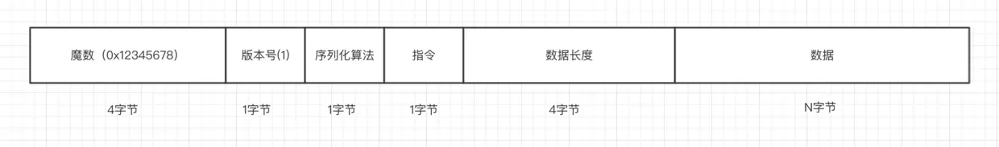

# netty

## IO概念
在1.4版本之前，Java IO类库是阻塞IO；从1.4版本开始，引进了新的异步IO库，被称为JavaNew IO类库，简称为JAVA NIO。New IO类库的目标，就是要让Java支持非阻塞IO，基于这个原因，更多的人喜欢称Java NIO为非阻塞IO（Non-Block IO），称“老的”阻塞式Java IO为OIO（Old IO）。总体上说，NIO弥补了原来面向流的OIO同步阻塞的不足，它为标准Java代码提供了高速的、面向缓冲区的IO。

NIO以下三个核心组件

- Channel 通道
	一个连接就是用一个Channel通道表示.最重要的四种Channel实现
	
	+ FileChannel 文件通道,用于文件的数据读写.
	+ SocketChannel 套接字通道,用于Socket套接字TCP连接的数据读写.(连接传输)
	+ ServerSocketChannel 服务器监听通道.允许我们监听TCP连接请求.(连接监听)
	+ DatagramChannel数据报通道，用于UDP协议的数据读写.
- Buffer  缓冲区
	本质是一个缓冲区,可以进行读写数据.是一个抽象类,内部是一个内存块(数组).
	
	- capacity 容量,可缓冲对象的数量
	- position 位置,读写的位置
- limit 读写的最大上限
	
	```
	在flip翻转时，属性的调整，将涉及position、limit两个属性，这种调整比较微妙，不是太好理解，举一个简单例子：首先，创建缓冲区。刚开始，缓冲区处于写模式。position为0, limit为最大容量。然后，向缓冲区写数据。每写入一个数据，position向后面移动一个位置，也就是position的值加1。假定写入了5个数，当写入完成后，position的值为5。这时，使用（即调用）flip方法，将缓冲区切换到读模式。limit的值，先会被设置成写模式时的position值。这里新的limit是5，表示可以读取的最大上限是5个数。同时，新的position会被重置为0，表示可以从0开始读
	```
	> 总体来说，使用Java NIO Buffer类的基本步骤如下：
	> 1. 使用创建子类实例对象的allocate()方法，创建一个Buffer类的实例对象。
	> 2. 调用put方法，将数据写入到缓冲区中。
	> 3. 写入完成后，在开始读取数据前，调用Buffer.flip()方法，将缓冲区转换为读模式。
	> 4. 调用get方法，从缓冲区中读取数据。
	> 5. 读取完成后，调用Buffer.clear() 或Buffer.compact()方法，将缓冲区转换为写入模式。
- Selector 选择器
	IO多路复用,一个线程可以监视多个文件描述符(一个网络连接,操作系统底层使用文件描述符表示),一旦其中的一个/多个文件描述符可读/可写,系统内核就通知该进程/线程.在Java应用层面,使用选择器实现对文件描述符的监视.
	选择器是一个IO事件的查询器,通过选择器,线程可以查询多个通道IO事件的状态.
	
	
## IO模型

1. 同步阻塞(**Blocking IO**)
2. 同步非阻塞(**Non-blocking IO**)
3. IO多路复用(**IO Multiplexing**):经典的Reactor反应器设计模式,也被称为异步阻塞IO
4. 异步IO(**Asynchronous IO**)

> 阻塞和非阻塞:**阻塞和非阻塞描述的是结果的请求**.
> **阻塞**:在得到结果之前,一直在等待.**非阻塞**:如果没有得到结果就返回,等一会儿再去请求,直到返回为止.
> 阻塞IO指的是需要内核IO操作彻底完成之后,才返回到用户空间执行用户的操作.阻塞指的是用户空间程序的执行状态.
>
> 同步和异步: **描述的是结果的发出**
> 同步IO是指用户空间的线程主动发起IO请求的一方,内核空间是被动接收方.异步IO反过来,系统内核是主动发起IO请求的一方.
> **同步** :在没获得结果之前不会返回给调用方,如果调用方是阻塞的,就会一直阻塞.如果调用方是非阻塞的,就会先回去,等会儿再来
> **异步**: 调用方一来,会直接返回.等执行完逻辑,通过回调函数返回给调用方

### 小结

Netty是建立在NIO基础之上,在NIO之上又提供了更高层次的抽象
Accept连接可以使用单独的线程池去处理,读写操作又是另外的线程池处理

## 基础

> 关于Netty：
>
> Netty是一个高性能、异步事件驱动的NIO框架，它提供了对TCP、UDP和文件传输的支持，作为一个异步NIO框架，Netty的所有IO操作都是异步非阻塞的，通过Future-Listener机制，用户可以方便的主动获取或者通过通知机制获得IO操作结果。作为当前最流行的NIO框架，Netty在互联网领域、大数据分布式计算领域、游戏行业、通信行业等获得了广泛的应用，一些业界著名的开源组件也基于Netty的NIO框架构建。
> 
> netty是对Java NIO和Java线程池技术的封装

- NIO是异步非阻塞
> 使用事件机制,用一个线程把accept/读写操作/请求处理的逻辑全干了,没有任务会把线程休眠,直到下一个事件来到.这样的线程成为NIO线程

### NIO线程模型

非阻塞型IO(non-blocking io),包含三个核心概念 Selector,Channel,Buffer

##### NIO工作流程

1. 首先创建一个Selector,用来监视管理各个Channel,也就是不同的客户端.相当于取代了以前BIO中的线程池,但是他只需要一个线程就可以处理多个Channel,没有上下文线程切换带来的消耗,提升了很大的性能
2. 创建一个ServerSocketChannel监听通信端口,并注册到Selector,让selector监听客户端的accept状态,也就是监听客户端请求
3. 客户端请求服务器,Selector就知道有客户端请求进来.然后可以得到客户端的SocketChannel,并为这个通道注册Read状态,也就是Selector会监听客户端发来的消息
4. 一旦接收到客户端的消息,就会用其他客户端的SocketChannel的Write状态,向他们转发客户端的消息

##### AIO工作流程

//todo

### reactor线程模型

- reactor单线程模型
- reactor多线程模型,在处理器链部分采用多线程,后端程序常用模型
> 
- reactor主从模型:多个acceptor的NIO线程用于接收客户端的连接
> 将reactor分成两部分,manReactor负责处理新的socket连接,把已经建立连接的socket分发给subReactor.subReactor负责多路分离已连接的socket,读写网络数据/业务处理
> 

### 组件

- EventLoop
- ChannelFuture:异步结果
- <font style="color:red;font-weight:bolder;">Channel:</font> **代表与客户端的连接,每创建一个Channel,就会被分配一个新的ChannelPipeline,这是固定的操作.**
- <font style="color:red;font-weight:bolder;">ChannelPipeline:</font> 提供了ChannelHandler链的容器.当Channel被创建时,会自动分配到专属的ChannelPiepeline.
  **ChannelHandler 安装到 ChannelPipeline 中的过程如下所示**

  1. *一个ChannelInitializer的实现被注册到了ServerBootstrap中*
  2. *当 ChannelInitializer.initChannel()方法被调用时,ChannelInitializer 将在 ChannelPipeline 中安装一组自定义的 ChannelHandler;*
  3. *ChannelInitializer 将它自己从 ChannelPipeline 中移除。*
  
  **方法**
  
  - remove:从pipeline中移除某个handler
  - addFirstaddBefore 添加
  - addAfteraddLast 添加
  - replace 替换
  
  > channelPipeline保存了与channel相关联的channelHandler.可以根据需要,添加或删除channelHandler动态的修改.有丰富的api可以被调用,响应入站和出站事件.
  
- <font style="color:red;font-weight:bolder;">ChannelHandler:</font> 事件处理

- <font style="color:red;font-weight:bolder;">ChannelHandlerContext:</font> **代表channelHandler和ChannelPipeline之间的关联,每当有channelHandler添加到channelPipeline中,都会创建ChannelHandlerContext.主要功能时管理与之关联的channelHanler和在同一个pipeline中其他channelhandler的交互**

  > ChannelHandlerContext 有很多的方法，其中一些方法也存在于 Channel 和 Channel-Pipeline 本身上，但是有一点重要的不同。如果调用 Channel 或者 ChannelPipeline 上的这些方法，它们将沿着整个 ChannelPipeline 进行传播。而调用位于 ChannelHandlerContext上的相同方法，则将从当前所关联的 ChannelHandler 开始，并且只会传播给位于该ChannelPipeline 中的下一个能够处理该事件的ChannelHandler。

- <font style="color:red;font-weight:bolder;"></font>


## TCP 粘包/拆包

- 粘包:发送端发包时把三个数据包粘成两个TCP包发送
- 拆包:接收端根据应用协议将两个TCP包拆成三个数据包

netty提供了四种解决方法

1. FixedLengthFrameDecoder：固定长度拆包器，每个数据包长度都是固定的。
2. LineBasedFrameDecoder：行拆包器，每个数据包之间以换行符作为分隔。
3. DelimiterBasedFrameDecoder：类似行拆包器，不过我们可以自定义分隔符。
4. LengthFieldBasedFrameDecoder：基于长度域拆包器，最常用的，只要你的自定义协议中包含数据长度这个部分，就可以使用。它需要三个参数，第一个是数据包最大长度、第二个是参数长度域偏移量、第三个是长度域长度

> **粘包/拆包处理要放在处理链中第一个**



## [netty视频笔记](https://v-wb.youku.com/v_show/id_XMzQ5NTE5MzEzNg==.html)

Channel是对socket的抽象,每个Channel对应一个ChannelPipline,ChannelPipline是一个包含了不同的ChannelHandler的双向链表,ChannelHandler可以处理InBound和OutBound事件

EventLoopGroup类似一个线程池,包含很多线程,用来处理分配给他们不同的Channel
EventLoop相当于Java中的Executor
EventExector相当于EventLoop


> channel 渠道
> pipline  管道


### 类库

1. 缓冲区 Buffer

   - 常用方法
     - allocate()  初始化一块缓冲区
     - put()  写入数据
     - get()  读取数据
     - filp()  缓冲区读写模式切换
     - clear()  利用后来写入的数据覆盖原来写入的数据,达到类似清除老数据的效果
     - compact()  从读数据模式切换到写数据模式,数据不会清空,会将所有未读数据copy到缓冲区头部,后续写数据不会覆盖,在这之后写数据
     - mark()  对position做出标记,配合reset()使用
     - reset()  将position置为标记值
   - 核心属性
     - capacity  缓冲区大小,缓冲区一旦创建,大小不能再改变
     - position  读写数据的定位指针,标识当前读取到哪一个位置
     - limit  读写边界,用于限制指针的最大指向位置.当指针走到边界上就要停止,否则会抛出BufferUnderflowException
   
   > Buffer实质上是个数组，有两个关键的指针，一个position代表当前数据写入到哪了、一个limit代表限制。初始化时设置了数组长度，这limit就是数组的长度。如：设置intBuffer.allocate(10)，最大存储10个int数据，写入5五个数据后，需要读取数据了。用filp()转换读写模式后，limit=position，position=0。也就是说从0开始读，只能读到第五个。读完后这个缓冲区就需要clear()了，实际上并没有真的去清空数据，而是position和limit两个指针又回到了初始化的位置，接着又可以写入数据了，反正数组下标相同重新写入数据会覆盖，就没必要真的去清空了。
   
   > ByteBuffer有几个缺陷
   >
   > 1. 长度固定 2. 读写状态需要通过flip()和rewind()来手动切换  3:功能有限
   
2. 通道 Channel

   Channel是一个通道,比较常用的Channel是SocketChannel和ServerSocketChannel.支持异步,通道本身不存放数据,只能通过buffer

3. 多路复用器 Selector

   用于检查一个或多个Channel通道的状态是否处于可读/可写.可以实现单个线程管理多个Channel,单线程管理多个网络连接.

   多个Channel可以注册到一个Selector,Channel在不同的时间点有不同的状态,Selector通过轮询达到监视的效果,如果检查到Channel的状态正好是Selector监视的状态,就可以查出来,进行对应的操作,以下状态

   - 客户端的SocketChannel和服务器建立连接,SocketChannel状态是**Connect**
   - 服务器端ServerSocketChannel接收到了SocketChannel的请求,ServerSocketChannel的状态就是**Accept**
   - SocketChannel有数据可读,他的状态是**Read**
   - 需要向Channel写数据,状态是**Write**

4. Netty中优化了ByteBuffer,类为ByteBuf

   > 1. ByteBuf 是一个字节容器，容器里面的的数据分为三个部分，第一个部分是已经丢弃的字节，这部分数据是无效的；第二部分是可读字节，这部分数据是 ByteBuf 的主体数据， 从 ByteBuf 里面读取的数据都来自这一部分;最后一部分的数据是可写字节，所有写到 ByteBuf 的数据都会写到这一段。最后一部分虚线表示的是该 ByteBuf 最多还能扩容多少容量。
   > 2. 以上三段内容是被两个指针给划分出来的，从左到右，依次是读指针（readerIndex）、写指针（writerIndex），然后还有一个变量 capacity，表示 ByteBuf 底层内存的总容量。
   > 3. 从 ByteBuf 中每读取一个字节，readerIndex 自增1，ByteBuf 里面总共有 writerIndex-readerIndex 个字节可读, 由此可以推论出当 readerIndex 与 writerIndex 相等的时候，ByteBuf 不可读。
   > 4. 写数据是从 writerIndex 指向的部分开始写，每写一个字节，writerIndex 自增1，直到增到 capacity，这个时候，表示 ByteBuf 已经不可写了。
   > 5. ByteBuf 里面其实还有一个参数 maxCapacity，当向 ByteBuf 写数据的时候，如果容量不足，那么这个时候可以进行扩容，直到 capacity 扩容到 maxCapacity，超过 maxCapacity 就会报错。

   常用API

   - **capacity()** :表示bytebuf底层占用了多少字节,包含丢弃字节/可读字节/可写字节
   - **maxCapacity()**: 表示bytebuf最大字节
   - **readableBytes()和isReadable()** :前者表示当前可读字节数,也就是写指针-读指针,后者表示是否可读
   - **writableBytes()/isWritable()/maxWritableBytes()** 第一个表示可写字节数,第二个表示是否可写,第三个表示最大可写字节数
   - **readerIndex()和readerIndex(int)** 前者返回当前的读指针,后者可以设置读指针
   - **writeIndex()和writeIndex(int)**  和上面一样
   - **markReaderIndex() 与 resetReaderIndex()**: 前者表示把当前读指针保存起来。后者表示把当前的读指针恢复到保存时的值。他们的功能其实readerIndex() 与 readerIndex(int)一样可以实现,但一般会选择下面两句,因为不用定义一个变量.
   - **writeBytes(byte[] src) 与 buffer.readBytes(byte[] dst)**:前者表示把src写到ByteBuf.后者表示把ByteBuf全部数据读取到dst.
   - **writeByte(byte b) 与 buffer.readByte()**:前者表示把字节b写道ByteBuf。后者表示从ByteBuf读取一个字节。类似的 API 还有 writeBoolean()、writeChar()、writeShort()、writeInt()、writeLong()、writeFloat()、writeDouble() 与 readBoolean()、readChar()、readShort()、readInt()、readLong()、readFloat()、readDouble() 这里就不一一赘述了。
   - **release() 与 retain()**:由于 Netty 使用了堆外内存，而堆外内存是不被 jvm 直接管理的，也就是说申请到的内存无法被垃圾回收器直接回收，所以需要我们手动回收。Netty 的 ByteBuf 是通过引用计数的方式管理的，如果一个 ByteBuf 没有地方被引用到，需要回收底层内存。默认情况下，当创建完一个 ByteBuf，它的引用为1，然后每次调用 retain() 方法， 它的引用就加一， release() 方法原理是将引用计数减一，减完之后如果发现引用计数为0，则直接回收 ByteBuf 底层的内存。
   - **slice()/duplicate()/copy()**:这三个都会返回一个新的ByteBuf。第一个是截取读指针到写指针范围内的一段内容。第二个是截取整个ByteBuf，包括数据和指针信息。第三个是拷贝所有信息，除了第二个API的内容还包括底层信息，因此拷贝后的新ByteBuf任何操作不会影响原始的ByteBuf.

