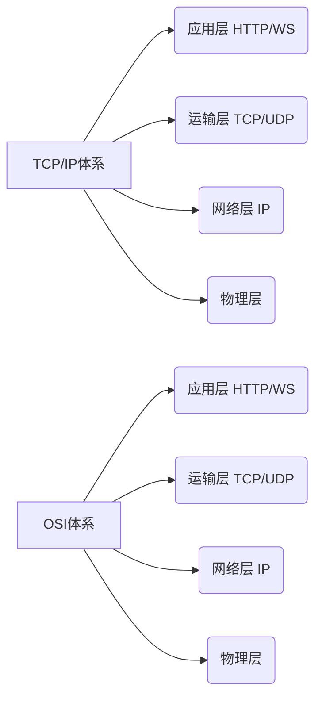

# 网络协议

| | TCP | UDP |
| :--: | :--: | :--: |
|连接| 面向连接 |无连接|
|传输可靠性 | 可靠 | 不可靠 |
|传输效率 | 低 | 高 |
|报文 |面向字节流 | 面向报文 |
|应用场景 | 数据 | 音视频 |
|例子 |http/smtp/ftp |dns/tftp/snmp |

> IP4是32位的,总数量只有2^32个,42亿多个
> 

#### NAT技术
- 主要解决IP地址不足的问题
- 保护内网不被外网攻击
- 服务端做负载均衡和高可用
- 透明代理
- NAT穿透技术弥补不能直连内网

#### IPv6  地址分为64位的主机地址(根据物理地址生成)和64位的网络前缀(统一管理部门发放)
- 地址数目32位升级到128位
- 地址格式 2001:0db8:xxx:xxx:xxxx:xxxx
- 数据包

### HTTP协议
- Http1.1(1999) 支持连接复用
- HTTP2.0 (2015)