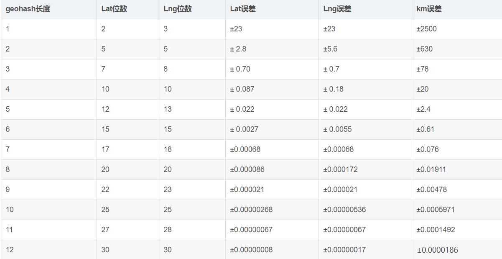

# GeoHash

### GeoHash将经纬度转换为字符串,在大多数情况下,字符串前缀匹配的越多距离越近,

- Latitude范围 -90~+90
- longitude范围  -180~+180
- 地球参考球体的周长：40075016.68米,极半径：6356908.8米，赤道半径:6377830，平均半径：6371393

###### 经纬度和GeoHash距离

###### 经纬度小数点和距离的关系

|赤道周长（米）| 度数（度）|
|---|---|
|40076000|360|
|111322.2222 | 1|
|11132.22222 | 0.1|
|1113.222222 | 0.01|
|111.3222222 | 0.001|
|11.13222222 | 0.0001|
|1.113222222 | 0.00001|
|0.111322222 | 0.000001|
|0.011132222 | 0.0000001|

