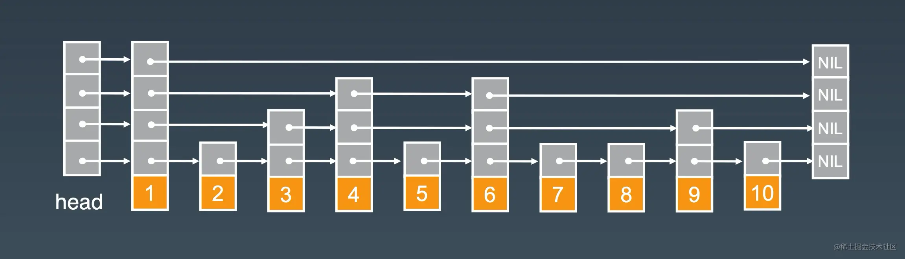

## 基础

### 计算机硬件相关知识点

在进程看来,访问的是连续的内存空间. 由计算机的页表机制映射到物理内存上. 
线程上下文切换很慢.**CPU执行是根据以时钟周期为单位(一个时钟周期为1纳秒(ns)). 内存寻址需要1~10us(微秒),磁盘寻址需要1~10ms(毫秒)**
进程中的线程映射在linux内存中是task

### Redis为什么这么快

> Redis单线程是指redis处理客户端连接,读/解析/执行/写 都是由一个线程完成的. 而其他的清理脏数据/无用连接释放/LRU淘汰策略是由其他线程完成的. 本质上也是多线程.

- 基于内存
- 基于事件驱动
- IO多路复用机制
  - 同时监控多个Socket
  - select/poll
    - 监控多个file descriptor(文件描述符，符合linux一切皆文件)
    - 当返回时,需要轮询FD列表检查是否有事件发生
  - epoll
    - 当返回时,只有有事件发生的FD会被返回
- **6.0之前单线程.6.0之后引入worker Thread,只处理网络IO的读取和写入,核心IO负责串联处理客户端命令，执行命令还是单线程。Redis瓶颈主要是网络和内存,不存在CPU造成瓶颈的情况,所以是单线程的.使用多线程能提升IO读写的效率，提高Redis的整体性能**

#### 多路IO复用模型

IO多路复用模型是利用select/poll/epoll可以同时监察多个流的io事件能力. 在空闲的时候,会把线程阻塞掉,当有一个流或多个流有io事件时, 把线程从阻塞状态唤醒, 去轮询流(epoll只轮询有io事件的流). 避免了大量的无用操作. 
**多路指的是多个网络连接,复用指的一个线程处理多个流** 
采用IO多路复用技术可以让单个线程高效的处理多个连接请求(减少线程上下文切换的开销时间),且redis在内存中操作数据的速度非常快,内存操作不能造成影响redis性能的因素.


### 命令和配置

```shell
redis-cli                                    # 登录
auth ""                                      # 密码认证
set <key> <value>                            # 设置键值对
get <key>                                    # 获取
exists <key>                                 # 判断是否存在
ttl <key>                                    # 查看过期时间(秒)
pttl <key>                                   # 查看过期时间(毫秒)
expire <key>  <expire_time>                  # 设置过期时间
strlen <key>                                 # 对应值的长度
del <key>                                    # 删除对应的键
type <key>                                   # 查看数据结构类型
rename <key> <newkey>                        # 重命名 newkey不存在时才会重命名
randomkey                                    # 随机返回一个key
```

#### redis实现主从相关命令

```shell
# 在从库执行
slaveof <master-ip> <master-port>  #<master-ip>为主库服务ip，<master-port>表示主库所在端口，默认6379
config set masterauth <master-pass>  # 访问主库的密码

info replication  # 查看主从信息
```

#### redis.conf配置

```shell
bind 127.0.0.1  # 可访问ip
daemonize yes   # 让redis服务后台运行
requirepass slavepassword # 从库密码，可选配置
timeout 0    #当客户端闲置多长秒后关闭连接，如果指定为 0 ，表示关闭该功能
loglevel     # 指定日志记录级别，Redis 总共支持四个级别：debug、verbose、notice、warning，默认为 notice
save <seconds> <changes>  # 指定在多长时间内，有多少次更新操作，就将数据同步到数据文件，可以多个条件配合
#Redis 默认配置文件中提供了三个条件：
#save 900 1
#save 300 10
#save 60 10000
#分别表示 900 秒(15分钟)内有 1 个更改，300 秒（5 分钟）内有 10 个更改以及 60 秒内有 10000 个更改.
maxclient  # 最大客户端连接数,默认为redis可以同时打开的最大的文件描述符
# 指定Redis最大内存限制，Redis在启动时会把数据加载到内存中，达到最大内存后，Redis会先尝试清除已到期或即将到期的Key，当此方法处理后，仍然到达最大内存设置，将无法再进行写入操作，但仍然可以进行读取操作。Redis新的vm机制，会把Key存放内存，Value会存放在swap区
maxmemory <bytes>

# 指定是否在每次更新操作后进行日志记录，Redis 在默认情况下是异步的把数据写入磁盘，如果不开启，可能会在断电时导致一段时间内的数据丢失。因为 redis 本身同步数据文件是按上面 save 条件来同步的，所以有的数据会在一段时间内只存在于内存中。默认为 no
appendonly no
appendfilename appendonly.aof #指定更新日志文件名，默认为 appendonly.aof
# 指定更新日志条件，共有 2 个可选值：
#  no：表示等操作系统进行数据缓存同步到磁盘（快）
#  always：表示每次更新操作后手动调用 fsync() 将数据写到磁盘（慢，安全）
#  everysec：表示每秒同步一次（折中，默认值）
appendsync everysync 


#指定是否启用虚拟内存机制，默认值为no，简单的介绍一下，VM机制将数据分页存放，由Redis将访问量较少的页即冷数据swap到磁盘上，访问多的页面由磁盘自动换出到内存中（在后面的文章我会仔细分析Redis的VM机制）
vm-enabled no
# 虚拟内存文件路径，默认值为/tmp/redis.swap，不可多个Redis实例共享
vm-swap-file /tmp/redis.swap
#将所有大于vm-max-memory的数据存入虚拟内存,无论vm-max-memory设置多小,所有索引数据都是内存存储的(Redis的索引数据 就是keys),也就是说,当vm-max-memory设置为0的时候,其实是所有value都存在于磁盘。默认值为0
vm-max-memory 0
# Redis swap文件分成了很多的page，一个对象可以保存在多个page上面，但一个page上不能被多个对象共享，vm-page-size是要根据存储的 数据大小来设定的，作者建议如果存储很多小对象，page大小最好设置为32或者64bytes；如果存储很大大对象，则可以使用更大的page，如果不确定，就使用默认值
vm-page-size 32
# 设置swap文件中的page数量，由于页表（一种表示页面空闲或使用的bitmap）是在放在内存中的，，在磁盘上每8个pages将消耗1byte的内存。
vm-pages 134217728

# <masterip>表示主库所在的ip，而<masterport>则表示主库启动的端口，默认是6379
slaveof <masterip> <masterport>
# 主库有密码必需要配置，<master-password>代表主库的访问密码
masterauth <master-password>

#作为从服务器，默认情况下是只读的（yes），可以修改成NO，用于写（不建议）。
slave-read-only yes

# 指定包含其它的配置文件，可以在同一主机上多个Redis实例之间使用同一份配置文件，而同时各个实例又拥有自己的特定配置文件
include /path/to/local.conf
```

### Redis过期和淘汰机制

redis配置文件中可以配置redis使用的内存最大值,如果达到最大值再写数据,redis有以下几种策略处理

> **LRU算法: less recently used 最少使用,是一种缓存置换算法. 核心思想是: 一个数据在最近没有被使用到,在将来也被使用的可能也很小,所以被淘汰掉.**
>
> **LFU算法: Least Frequently used, 核心思想是根据key的被访问频率进行淘汰,很少被访问的优先被淘汰. 被访问多的被留下. LFU算法只在4.0以后的版本有效. **
>
> LFU算法有两种淘汰策略
>
> 1. volitile-lfu: 在设置了过期时间的key中使用lfu算法进行淘汰 
> 2. allkeys-lfu: 在所有key中使用lfu算法进行淘汰
>
> **LFU算法能更好的表示数据的热度,**

- **noevication(默认策略): **对于写请求不再提供服务,直接返回错误.(DEL请求和部分特殊请求除外)
- **allkeys-lru:** 从所有key中使用lru算法进行淘汰
- **volatile-lru: **从设置了过期时间的key中使用lru算法进行淘汰
- **allkeys-random:** 从所有key中随机淘汰数据
- **volatile-random: ** 从设置了过期时间的key中随机淘汰
- **volatile-ttl:  ** 从设置了过期时间的key中根据过期时间进行淘汰, 越早过期优先被淘汰

> 当使用volatile-lru/volatile-random/volatile-ttl策略时,如果没有key可以被淘汰,依然返回错误.

1. 从设置过期的key中淘汰一批最早过期的key
2. 从设置过期的key中淘汰一批热度最小的key
3. 从所有key中淘汰一批最早过期的key
4. 从所有key中淘汰一批热度最小的key
5. 随机淘汰
6. 禁止驱除数据. 内存不足时,写入数据会报错.

### Redis过期数据的删除策略

- 惰性删除: 不会主动删除,查询key时先判断是否过期,如果过期则删除.
- 定期删除: 随机抽取一些key,检查过期时间.


## 数据类型

### string
**字符串,可变的字节数组,最大长度为512M,小于1M,扩容是加倍现有空间,大于1M,每次扩容1M**

```shell
set <key> <value>                            # 设置键值对
get <key>                                    # 获取
exists <key>                                 # 判断是否存在
ttl <key>                                    # 查看过期时间(秒)
pttl <key>                                   # 查看过期时间(毫秒)
expire <key>  <expire_time>                  # 设置过期时间
strlen <key>                                 # 对应值的长度
del <key>                                    # 删除对应的键
type <key>                                   # 查看数据结构类型
rename <key> <newkey>                        # 重命名 newkey不存在时才会重命名
getrange <key> <start> <end>                 # 获取子串,指定位置开始和结束
append <key>  <value>                        # 追加字串
incrby                                       # +
decrby                                       # -
incr                                         # +1
decr                                         # -1
```

### hash

hash,使用二维结构,第一维是数组,第二维是链表.hash内容的key和value放在链表中,数组保存的是链表的头指针.通过key查找元素时,先计算key的hashcode,再根据hashcode值对数组取模运算,定位到对应的链表,再对链表遍历进行取值.链表的作用就是用来将产生**hash碰撞**的元素串起来

```shell
hset <key> <field> <value>                   # 设置值
hget <key> <field>                           # 获取值
hdel <key> <field>
hlen <key>                                   # field 个数
hmget <key> <field> [...]
hmset <key> <field> [...]
hkeys <key>                                  # 获取所有field
hvals <key>                                  # 获取所有value
hgetall <key>
hstrlen <key> <field>                        # 获取字段长度
hexists <k> <f>                              # 判断是否有某field
hincrbyfloat <k> <f> <increment>             # key指定字段增加数值(float)
hincrby <k> <f> <increment>                  # key指定字段增加数值(int)
hscan <k> <cursor>                           # 迭代hash表中的值
```

当hash比较拥挤时(hash碰撞比较频繁),就要进行扩容. 会申请两倍旧数组大小,然后将所有链表重新分配到新的数组中.


### list:列表

**存储结构为链表.双向链表,首尾插入删除效率高.下标可以为负数.索引查询很慢.**

```shell
# 新增
rpush <key> <value> [value...]                # 右边插入元素
lpush <key> <value> [value...]                # 左边插入元素
linsert <key> before/after <value> <value>    # 指定位置添加元素
# 查找
lrange <key> <start> <end>                    # 查看
lindex <key> <index>                          # 获取指定下标的元素
llen <key>                                    # 列表长度
# 删除
lpop <key>
rpop <key>
lrem <key> <count> <value>
# Lrem命令会从列表中找到=value的元素进行删除，根据count的不同分为3中情况
# Count>0,从左到有，删除最多count个元素
# Count<0,从右到左，删除最多count绝对值个元素
# Count=0,删除所有
# 修改
lset <key> <index> <value>
```

### Set:集合

**内部使用的hash结构,所有value指向同一个內部值NULL**

```shell
sadd <key> <e>                              # 添加值
srem <key> <e>                              # 删除
scard <key>                                 # 元素个数
sismember <k> <e>                           # 在集合中则返回1，否则返回0
srandmember <k> [count]                     # 随机返回指定个数,count可不写，默认为1
spop <k> [count]                            # 随机返回元素
```

### zset:有序集合
**在集合的基础上进行延伸有序,K是V的一个键值对,键值对的分数score:V,默认从小到大.使用HASH和跳跃表实现的(Skip List)，即使读取位于中间的数据也很快，时间复杂度是(O(Log(n)))**

```shell
zadd <key> <score> <member> [score,member...] # 向zset中添加值
zrange <key> 0 -1;                            # 查看值
zrange <key> 0 -1 withscores;                 # 查看值和分数

zrangebyscore <key> <startScore> <endScore> [withscores]   # 局部范围的分数

zrem <key> <member>                           # 删除元素

zcard <key>                                   # 获取zset值的数量
zcount <key> <startScore> <endScore>          # 获取指定分值区间的值数量
zrank <key> <member>                          # 获取该值的索引下标
zscore <key> <member>                         # 获取该值对应分数
```

#### 跳跃表

只能用于数据有序的情况，对表的是平衡树和二分查找，插入/删除/搜索的时间复杂度都是O(log(n))的数据结构。通过添加多级索引实现，空间换时间的实现。


跳跃表的构成
- 表头:负责维护跳跃表的节点指针
- 跳跃表节点：保存着元素值，以及多个层
- 层：保存着指向其他元素的指针。高层的指针越过的元素数量低于低层的，查找时总是从最高层开始查找
- 表尾：全部由NULL组成，表示跳跃表的结尾

### GEOHASH地理位置相关指令(实现附近的人)

Redis结合有序队列zset以及geohash编码,实现空间搜索功能.Geo模块六个指令

- GEOADD(geo add):将给定的位置对象(经度/维度/名字)添加到指定的key.
- GEOPOS(geo pos):从key里面返回所有给定位置对象的位置(经度/纬度)
- GEODIST(geo dist):返回两个给定位置之间的距离
- GEOHASH(geo hash):返回一个或多个给定位置的geohash表示
- GEORADIUS(geo radius):以给定的经纬度为中心,返回目标集合中与中心的距离不超过给定最大距离所有位置对象
- GEORADIUSBYMEMBER(geo radius by member):以给定的位置对象为中心,返回与其距离不超过给定的最大距离的所有位置对象

> 组合使用geoadd和georadius实现附近的人中增/查功能.实现类似微信附近的人功能,使用geo radius by member命令
> 
> 使用时注意点:
> 1. redis geo操作只包含增/查功能,没有删除功能.因为redis使用zset保存位置对象,使用zrem删除
> 

使用方式
> 范围单位(unit) m | km | ft | mi --> 米 | 千米 | 英尺 | 英里
```shell
geoadd key longitude latitude member [long...]      # 添加对象
georadius <key> <lon> <lat> <radius> <unit>         # 查找位置对象,参数
geopos <key> <member>                               # 查看对象的经纬度
geodist <key> <member1> <mbmber2> [unit]            # 查看两个对象距离
geohash <key> <member>                              # 查看对象hash值
georadiusbymember <key> <member> <radius> <unit>    # 查看对象指定距离的对象
```

> 经差一度距离: 91291 m
>    一分        : 1420  m
>    一秒        : 23.6 m 
> 纬差一度距离: 110950 m
>     一分   1850 m
>     一秒   30.9 m

#### [GeoHash](./GeoHash.md)


## 持久化

**RDB:把当前进程数据生成快照保存到硬盘的过程，触发RDB有两种方式，`save`和`bgsave`方式**
- save：阻塞当前服务器，直到RDB完成，生产不建议使用
- bgsave：Redis进程执行fork操作创建子进程，RDB由过程由子进程处理，阻塞只发生在fork阶段，时间很短

**AOF(append-only file): 以独立日志的方式记录每次写命令，重启时再重新执行aof的命令达到恢复数据的目的。是目前主要使用的持久化方式**
AOF流程
1. 所有的写入命令会追加到aof_buf(缓冲区)中
2. AOF缓冲区根据对应的策略向硬盘做同步操作
3. AOF文件越来越大，需要定期对AOF文件进行重写
4. Redis服务器重启，加载AOF文件进行恢复

AOF重写有两种方式，和RDB写入类似
- REWRITE：在主线程重写AOF，会阻塞工作线程，生产环境不建议使用
- BGWRITE：在后台子进程中重写AOF，不会阻塞工作线程

Redis4.0 支持混合持久化,AOF重写的时候就是把RDB的内容直接写到AOF文件中,可读性不高.  好处是结合了AOF和RDB的优点.

### RDB和AOF的比较

RDB: 适合备份/全量复制的场景，恢复速度快。实时性低，无法做到秒级持久化，新版本无法兼容老版本。
AOF: 实时性好，秒级持久化，每一次命令都会记录到AOF文件中。文件比较大，恢复起来速度慢。

### Redis启动时加载数据的流程

1. AOF持久化开启且存在AOF文件时，优先加载AOF文件
2. AOF关闭或者AOF文件不存在时，加载RDB文件
3. 加载AOF/RDB文件成功后，Redis启动成功
4. AOF/RDB文件存在错误时，redis启动失败并打印错误信息

## 高可用 分为三种:主从/哨兵/集群

### 主从复制

- 数据冗余: 实现数据热备份，持久化之外的一种备份方式
- 故障恢复: 主节点出现问题时，可以由从节点支持服务，实现快速故障恢复
- 负载均衡: 读写分离，主写从读，减小单个服务节点的压力，提高并发量
- 高可用基石: 哨兵/集群都是基于主从复制的

#### 主从复制拓扑结构

- 一主一从
- 一主多从
- 树状主从:又称树状拓扑结构，使从节点不但从主节点复制数据，同时可以作为其他从节点的住节点继续向下复制


#### 主从复制的原理


1. 保存主节点的信息(ip+port)
2. 主从建立连接，从节点发现新的主节点后，会尝试和主节点建立连接
3. 建立连接成功后，会发送ping命令进行通信，检测主从网络之间是否可用/主节点是否可以接受处理命令
4. 权限验证，如果主节点需要密码认证，从节点需要正确的密码才能通过验证
5. 连接正常，权限验证通过后，主节点会把所有的数据传输给从节点
6. 接下来主节点会持续把命令发送给从节点，保持数据一致性

#### 主从数据同步的过程


Redis2.8以上的版本使用psync命令完成主从数据同步，有全量复制和部分复制两种

1. 发送psync命令进行数据同步，由于是第一次进行复制，从节点没有复制偏移量和主节点的运行ID，所以发送psync-1。
2. 主节点根据psync-1解析出当前为全量复制，回复+FULLRESYNC响应。
3. 从节点接收主节点的响应数据保存运行ID和偏移量offset
4. 主节点执行bgsave保存RDB文件到本地
5. 主节点发送RDB文件给从节点，从节点把接收的RDB文件保存在本地并直接作为从节点的数据文件
6. **对于从节点开始接收RDB快照到接收完成期间，主节点仍然响应读写命令，因此主节点会把这期间写命令数据保存在复制客户端缓冲区内，当从节点加载完RDB文件后，主节点再把缓冲区内的数据发送给从节点，保证主从之间数据一致性。**
7. 从节点接收完主节点传送来的全部数据后会清空自身旧数据
8. 从节点清空数据后开始加载RDB文件
9. 从节点成功加载完RDB后，如果当前节点开启了AOF持久化功能， 它会立刻做bgrewriteaof操作，为了保证全量复制后AOF持久化文件立刻可用。

#### 主从结构的缺点

- 一旦主节点出现故障，需要手动把从节点变成主节点，需要人工干涉。
- 主节点写和存储的能力受到单机限制

### 哨兵(Redis Sentinel) 基础

由两部分组成
- 哨兵节点：不存储数据，对数据节点进行监控
- 数据节点：主节点和从节点都是存储数据

哨兵的功能
- 监控（Monitoring）： 哨兵会不断地检查主节点和从节点是否运作正常。
- 自动故障转移（Automatic failover）： 当主节点不能正常工作时，哨兵会开始自动故障转移操作，它会将失效主节点的其中一个 从节点升级为新的主节点，并让其他从节点改为复制新的主节点。
- 配置提供者（Configuration provider）： 客户端在初始化时，通过连接哨兵来获得当前 Redis 服务的主节点地址。
- 通知（Notification）： 哨兵可以将故障转移的结果发送给客户端。

#### 哨兵原理

- 定时监控三个定时任务Redis Sentinel通过三个定时监控任务完成对各个节点发现和监控：
  - 每隔10秒，每个Sentinel节点会向主节点和从节点发送info命令获取最新的拓扑结构
  - 每隔2秒，每个Sentinel节点会向Redis数据节点的__sentinel__：hello 频道上发送该Sentinel节点对于主节点的判断以及当前Sentinel节点的信息
  - 每隔1秒，每个Sentinel节点会向主节点、从节点、其余Sentinel节点发送一条ping命令做一次心跳检测，来确认这些节点当前是否可达

- 主观下线和客观下线 主观下线就是哨兵节点认为某个节点有问题，客观下线就是超过一定数量的哨兵节点认为主节点有问题。 主观下线和客观下线
  - 主观下线 每个Sentinel节点会每隔1秒对主节点、从节点、其他Sentinel节点发送ping命令做心跳检测，当这些节点超过 down-after-milliseconds没有进行有效回复，Sentinel节点就会对该节点做失败判定，这个行为叫做主观下线。
  - 客观下线 当Sentinel主观下线的节点是主节点时，该Sentinel节点会通过sentinel is- master-down-by-addr命令向其他Sentinel节点询问对主节点的判断，当超过 <quorum>个数，Sentinel节点认为主节点确实有问题，这时该Sentinel节点会做出客观下线的决定

- 领导者Sentinel节点选举 Sentinel节点之间会做一个领导者选举的工作，选出一个Sentinel节点作为领导者进行故障转移的工作。**Redis使用了Raft算法实现领导者选举。**

- 故障转移，领导者选举出的Sentinel节点负责故障转移，过程如下： 故障转移
  - 在从节点列表中选出一个节点作为新的主节点，这一步是相对复杂一些的一步
  - Sentinel领导者节点会对第一步选出来的从节点执行slaveof no one命令让其成为主节点
  - Sentinel领导者节点会向剩余的从节点发送命令，让它们成为新主节点的从节点
  - Sentinel节点集合会将原来的主节点更新为从节点，并保持着对其关注，当其恢复后命令它去复制新的主节点

#### 领导者Sentinel节点选举

- 每个在线的Sentinel节点都有资格成为领导者，当它确认主节点主观 下线时候，会向其他Sentinel节点发送sentinel is-master-down-by-addr命令， 要求将自己设置为领导者。
- 收到命令的Sentinel节点，如果没有同意过其他Sentinel节点的sentinel is-master-down-by-addr命令，将同意该请求，否则拒绝。
- 如果该Sentinel节点发现自己的票数已经大于等于max（quorum， num（sentinels）/2+1），那么它将成为领导者。
- 如果此过程没有选举出领导者，将进入下一次选举。

### 集群

解决了高可用和分布式的问题

1. 数据分区：也称数据分片是集群最核心的功能。将数据分散到多个服务上，减小了单个服务的压力，存储容量增加很多，同时每个节点都可以提供读写
2. 高可用：集群支持主从复制和自动故障转移，任一节点发生问题时，仍然可以提供对外的服务

#### 集群如何进行数据分区/分片

1. 节点取余分区:根据Redis的键或用户ID对hash值取余，算出存储在哪个节点上。缺点是进行扩容/收缩时，数据存储位置需要重新计算，数据需要迁移
2. 一致性HASH分区：将整个hash值空间组成一个虚拟圆环，将节点ip或主机名进行hash计算后，放置在圆环上。存取key也是通过hash计算，确认圆环位置。缺点是圆环上节点分布不均匀，造成部分节点压力大。
3. 虚拟槽分区：在一致性HASH分区的基础上，增加了槽的概念，槽是介于数据和实际节点之间的虚拟概念，把每个节点分成若干个槽，通过槽去管理数据。 解藕了数据和节点的直接关系。

## 缓存设计

- 缓存击穿: **大量的请求同时查询一个key,此时key失效,会导致大量的请求达到数据库**.造成数据库某一时刻压力巨大.可以通过设置热点数据不过期的方式解决
- 缓存雪崩: **某一时刻大规模缓存失效. 进来的请求都落在数据库上,造成服务宕机.**
  - 在原有的失效时间加上随机值，保证不在一个时间点过期
  - 热点数据永不过期
  - 集群部署
  - 服务融断降级
- 缓存穿透：查询数据库和缓存都没有的数据. 被用户恶意刷接口,造成数据库压力大.
  1. 布隆过滤器. 
  2. 缓存空值. 设置很短的过期时间.
  3. 增加参数校验.

**布隆过滤器**

是由一个位数组和一组随机函数组成.布隆过滤器可以检索某个元素是否存在于某个集合中.
优点是空间效率和查询效率比较高,缺点是有一定的误差率和删除困难.
原理是当一个元素加入到集合时,使用一组随机函数进行计算,得到位数组中对应的位置,并把这些位置的值置为1.
判断元素是否存在时,首先对元素进行一组随机函数计算,然后判断得到的索引中的值是否全部为1,如果是,则说明元素可能存在集合中,如果有0,则集合中一定没有元素.
使用bloom filter时,预估数据量n和期盼的错误率fpp很重要. 
当期望误判率越低的情况下,位数组的容量越大.

### 如何保证缓存和数据的一致性

依据CAP理论，保证可用性和分区容错性的情况下，无法保证绝对一致性，只能尽量保证最终一致性。
- 删除缓存而不是更新缓存
- 删除缓存更新库再添加缓存

### 缓存预热怎么做

1. 直接写个缓存刷新页面或者接口，上线时手动操作
2. 数据量不大，可以在项目启动的时候自动进行加载
3. 定时任务刷新缓存.

## Redis的应用

### Lua脚本

优点是Lua脚本在Redis中是原子执行的，执行中不会插入其他命令
可以使开发人员定制Lua命令，常驻在内存中，实现复用的效果
可以将多个命令打包一块执行，减少网络IO

一段Lua脚本，实现扣减Redis库存
```lua
  -- 库存未预热
   if (redis.call('exists', KEYS[2]) == 1) then
        return -9;
    end;
    -- 秒杀商品库存存在
    if (redis.call('exists', KEYS[1]) == 1) then
        local stock = tonumber(redis.call('get', KEYS[1]));
        local num = tonumber(ARGV[1]);
        -- 剩余库存少于请求数量
        if (stock < num) then
            return -3
        end;
        -- 扣减库存
        if (stock >= num) then
            redis.call('incrby', KEYS[1], 0 - num);
            -- 扣减成功
            return 1
        end;
        return -2;
    end;
    -- 秒杀商品库存不存在
    return -1;
```


### Redis分布式锁的实现

1. 使用setnx(set if not exists)命令，缺点是可能发生死锁，无法释放
2. 加上锁超时时间
3. 使用专业的基于Redis的分布式锁实现，`Redisson`.

#### Redission

Watch Dog 机制是一个后台定时任务线程，获取锁成功之后，会将持有锁的线程放入到一个 `RedissonLock.EXPIRATION_RENEWAL_MAP`里面，然后每隔10秒(internalLockLeaseTime/3)检查一下,如果客户端1还持有锁 key(判断客户端是否还持有 key,其实就是遍历EXPIRATION_RENEWAL_MAP里面线程id然后根据线程id去Redis中查,如果存在就会延长 key 的时间),那么就会不断的延长锁key的生存时间.
redisson的hash结构中 key 是锁的名称，field 是客户端 ID，value 是该客户端加锁的次数。通过次数实现可重入锁。